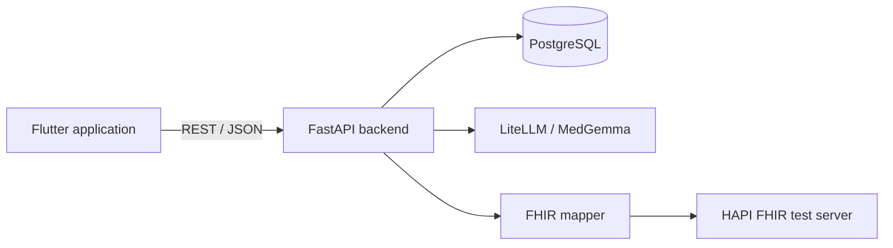

# Medical Software Project SS26 - Team MedBitAid

## Project Context

This project is being developed as part of the Medical Software Project SS26. Collaboration takes place via feature branches and pull requests; changes to the main branch require a review. Organizational roles and team agreements are maintained separately from the technical project documentation under `documents/team/`.

> **Disclaimer:** This project was created using AI assistants.

## Core Features

- guided Careena chat for structured symptom collection
- safety logic for red flags and acute emergencies
- explicitly requested recommendations with urgency and care levels
- user accounts and personal or managed medical profiles
- persistent chat history with support for resuming active sessions
- symptom diary and medication plan
- appointment management and PDF recommendation export
- FHIR bundle export and a local HAPI FHIR test server
- responsive Flutter frontend for web and supported native platforms

## Architecture



The frontend communicates with the backend through a central API layer. FastAPI provides authentication, profiles, medications, symptoms, chat history, and the Careena chat API. SQLModel maps persistent data to PostgreSQL. The Careena4 pipeline separates conversation control, case state, safety evaluation, and recommendation generation.

## Technology Stack

| Area | Technologies |
|---|---|
| Frontend | Flutter, Dart |
| Backend | Python 3.12, FastAPI, Uvicorn |
| Database | PostgreSQL 16, SQLModel, psycopg |
| AI integration | LiteLLM-compatible API, MedGemma |
| Interoperability | FHIR resources, HAPI FHIR |
| Infrastructure | Docker Compose |
| Quality assurance | pytest, flutter_test, GitHub Actions |

## Project Structure

```text
MEP_SS26/
|-- app1/                 Flutter frontend
|   |-- lib/              Application code
|   `-- test/             Unit and widget tests
|-- server/               FastAPI backend
|   |-- careena4/         Chat, case, safety, and recommendation logic
|   |-- database/         SQLModel models and catalog data
|   `-- tests/            Backend tests
|-- documents/            Test, integration, and team documentation
|-- docker-compose.yml    PostgreSQL and local HAPI FHIR server
|-- SETUP.md              Local development guide
`-- README.md
```

## Getting Started

See [SETUP.md](SETUP.md) for the complete local setup, including environment variables, PostgreSQL, the backend, and the Flutter application.

After creating `.env` and activating the Python virtual environment as described in the setup guide:

```bash
docker compose up -d

cd server
python -m pip install -r requirements.txt
python -m uvicorn main:app --reload
```

In a second terminal:

```bash
cd app1
flutter pub get
flutter run -d chrome
```

## Tests

```bash
# Backend
cd server
python -m pytest tests -q

# Frontend
cd app1
flutter analyze
flutter test
```

GitHub Actions automatically run the frontend and backend checks for pushes and pull requests.

## Local Services

| Service | Address |
|---|---|
| Backend | `http://localhost:8000` |
| OpenAPI documentation | `http://localhost:8000/docs` |
| Server health check | `http://localhost:8000/health/server` |
| PostgreSQL | `localhost:5433` |
| HAPI FHIR | `http://localhost:8080/fhir` |

## Documentation

- [Backend test cases](documents/testing/Testfaelle_Backend.md)
- [Frontend test cases](documents/testing/Testfaelle_Frontend.md)
- [Local FHIR test server](documents/integration/fhir_server_documentation.md)
- [Team documentation](documents/team/)

## Project Context

This project is developed as part of the Medical Software Project SS26. Development uses feature branches and pull requests, and changes to the main branch require a review. Organizational roles and team agreements are maintained separately from the technical documentation under `documents/team/`.
