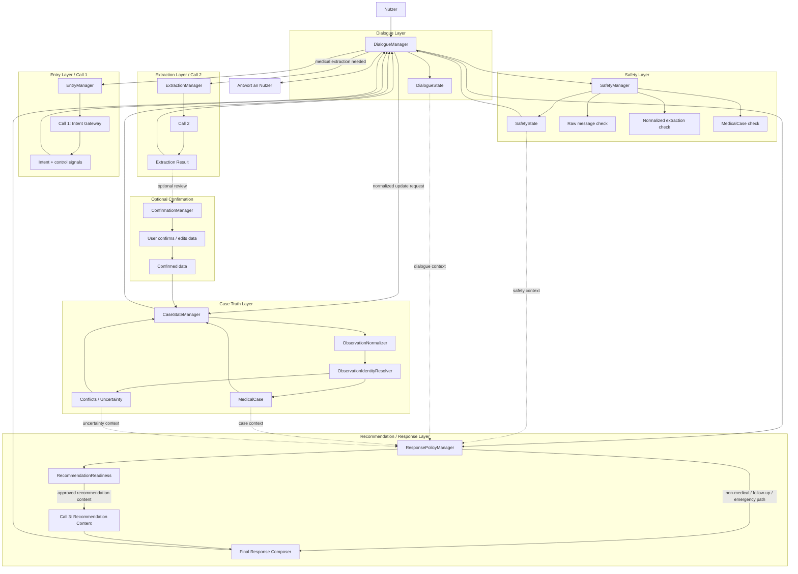
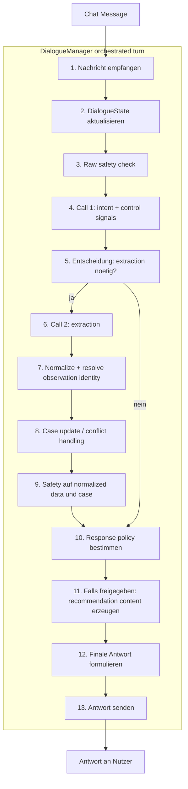

# Careena Target Model 6

Artefakt: CONTRACT
Status: draft
Bezug: aufbauend auf `TARGET_MODEL5.md` und `CAREENA3_ARCHITECTURE_EXECUTIVE_SUMMARY.md`

Wichtig: dieses modell beschreibt bewusst den architektonischen Kern von
Careena3. Es ist kein vollstaendiges Systeminventar, sondern ein
Soll-Zielbild fuer die fachlich wichtigen Verantwortungen, Vertraege und
Steuerfluesse.

## Zweck

Dieses Target Model schaerft die Zielarchitektur in drei Punkten nach:

- der `DialogueManager` bleibt die sichtbare Orchestrierungsmitte
- Extraktion wird klar von kanonischer Case-Wahrheit getrennt
- Recommendation und Antworterzeugung werden als freigegebene, gestufte
  Entscheidungen modelliert statt als direkte Folge einzelner Nutzernachrichten

## Leitprinzipien

- Keine versteckte medizinische Heuristik als Ersatz fuer Architektur
- Kleine, sichtbare Signale statt impliziter Sonderlogik
- Extraktion ist Input, aber nicht automatisch Wahrheit
- Kontext dient der Einordnung, nicht der stillen Faktenerfindung
- Konflikte, Unsicherheit und offene Punkte bleiben sichtbar
- Recommendation ist ein eigener freizugebender Pfad, kein Default-Ausgang

## Zentrale Architekturentscheidung

Der wichtigste Unterschied zu `TARGET_MODEL5.md` ist:

- `Call 2` erzeugt keine direkte Wahrheit im `MedicalCase`
- zwischen Extraktion und `MedicalCase` liegt eine explizite
  Normalisierungs- und Update-Schicht
- diese Schicht entscheidet ueber Observation-Identitaet, Merge-Semantik,
  Konflikte und Vertrauensgrad

Damit wird das eigentliche Kernproblem von Careena3 sichtbar modelliert:
nicht nur "was wurde extrahiert?", sondern "wie wird daraus stabile
Case-Wahrheit?"

## Kernbausteine

### 1. Dialogue Layer

- `DialogueManager`
- `DialogueState`

Verantwortung:

- fuehrt den gesamten Turn sichtbar
- sammelt Signale aller Unterkomponenten
- trifft die explizite Ablaufentscheidung fuer Extraction, Safety, Follow-up,
  Recommendation und Response

### 2. Entry Layer / Call 1

- `EntryManager`
- `Call 1: Intent Gateway`
- `Call 1 Result`

Verantwortung:

- Einordnung der eingehenden Nachricht
- Erzeugung kleiner Steuersignale wie
  `message_role`, `operation_mode`, `call2_tasks`, `pending_followup`
- keine versteckte medizinische Falllogik

### 3. Extraction Layer / Call 2

- `ExtractionManager`
- `Call 2`
- `Extraction Result`

Verantwortung:

- strukturierte medizinische Information aus der aktuellen Nachricht ableiten
- nur Beobachtungen, Behauptungen, Korrekturen, Bestaetigungen und Hinweise
  liefern
- kein direktes Schreiben in den kanonischen Case-State

### 4. Case Truth Layer

- `CaseStateManager`
- `ObservationNormalizer`
- `ObservationIdentityResolver`
- `MedicalCase`
- optional: `CaseConflicts` / `CaseUncertainty`

Verantwortung:

- normalisiert extrahierte Information in kanonische Form
- entscheidet, ob Information
  dieselbe Observation erweitert,
  eine Observation korrigiert,
  eine Observation bestaetigt oder
  eine neue Observation erzeugt
- fuehrt nur bewusste Updates in den `MedicalCase` aus
- macht Konflikte und Unsicherheit sichtbar statt sie wegzuheilen

### 5. Safety Layer

- `SafetyManager`
- `SafetyState`

Verantwortung:

- Safety-Pruefung auf mehreren Ebenen
  raw message
  normalized extraction
  canonical medical case
- liefert Safety-Signale an den `DialogueManager`
- entscheidet nicht heimlich ueber die Gesamtantwort

### 6. Recommendation / Response Layer

- `ResponsePolicyManager`
- `RecommendationReadiness`
- `Call 3: Recommendation Content`
- `Final Response Composer`

Verantwortung:

- trennt sauber zwischen
  Nutzer will Empfehlung,
  System ist informationsseitig bereit,
  Recommendation-Pfad ist freigegeben,
  Recommendation-Inhalt wird erzeugt,
  finale Antwort wird formuliert
- verhindert, dass Recommendation ungeprueft als Standardantwort entsteht

### 7. Optional Confirmation Layer

- `ConfirmationManager`
- Nutzer bestaetigt / korrigiert extrahierte Daten

Verantwortung:

- erlaubt bewusstes User-Feedback zu unsicheren oder sensiblen Extraktionen
- liefert hoeherwertige Updates an die Case-Truth-Schicht

## Architekturkarte

## Soll-Sequenz pro Turn

## Wichtige Vertraege

### Vertrag A: Entry zu Dialogue

`Call 1` liefert nur Steuersignale und Einordnung, insbesondere:

- `message_role`
- `operation_mode`
- `call2_tasks`
- `pending_followup`
- optional Fokusanker

`Call 1` liefert keine versteckte Gesamtentscheidung ueber den Fall.

### Vertrag B: Extraction zu Case Truth

`Call 2` liefert extrahierte Information, aber kein direktes `MedicalCase`.

Die naechste Schicht muss explizit beantworten:

- Was ist die kanonische Bedeutung?
- Welche Observation ist betroffen?
- Ist das neu, bestaetigend, korrigierend oder widerspruechlich?
- Mit welchem Vertrauens- und Konfliktstatus soll es gespeichert werden?

### Vertrag C: Case Truth zu Response

Die Response-Schicht konsumiert:

- `MedicalCase`
- sichtbare Konflikte / Unsicherheit
- `SafetyState`
- `DialogueState`

Sie darf keine stillen medizinischen Fakten aus Summaries oder Kontext
nacherfinden.

### Vertrag D: Recommendation Gate

Recommendation ist nur erlaubt, wenn getrennt beantwortet wurde:

- Will der Nutzer ueberhaupt eine Empfehlung?
- Ist der Fall informationsseitig hinreichend vorbereitet?
- Gibt es Safety- oder Konfliktsignale, die Recommendation begrenzen?
- Welche Art Antwort ist freigegeben:
  Follow-up,
  Non-medical,
  Emergency,
  Recommendation

## Warum dieses Modell besser ist als Target Model 5

- es macht die Case-Wahrheit zur eigentlichen Kernarchitektur
- es trennt Extraktion sichtbar von Merge und Wahrheit
- es reduziert das Risiko versteckter Heuristik in Managern
- es modelliert Recommendation als Gate statt als direkte Textproduktion
- es gibt Unsicherheit und Konflikten einen eigenen Platz
- es passt enger zur Executive-Summary-These, dass Careena3 ein
  Architektur-Neuschnitt und keine blosse Migration ist

## Offene Architekturfragen

Diese Punkte sind weiter offen, sollten aber in diesem Modell explizit
bearbeitet werden:

- genaue Datenstruktur einer `Observation`
- Regeln fuer `ObservationIdentityResolver`
- Semantik fuer Korrektur, Bestaetigung, Widerspruch und Ergaenzung
- Umgang mit mehreren gleichzeitigen Beschwerden / Problemstraengen
- Schwelle und UX fuer Nutzer-Confirmation
- genaue Freigabekriterien fuer `RecommendationReadiness`

## Fazit

`TARGET_MODEL6` verschiebt den Fokus von einer reinen Manager-Landkarte hin zu
einem belastbareren Sollmodell fuer Wahrheitsbildung, Steuerung und
freigegebene Antworterzeugung. Der zentrale architektonische Hebel ist nicht
mehr nur "welcher Call passiert wann", sondern "wie wird extrahierte
Information kontrolliert zu stabiler, sichtbarer Case-Wahrheit".
