# Careena Architecture Reduction And Rebuild Concept

Stand: 2026-06-12
Status: working concept

## Zweck

Diese Datei betrachtet bewusst das allgemeine System von Careena
und nicht nur den engeren Turn-Kern von `careena_pipeline3`.

Sie soll zwei Dinge gleichzeitig leisten:

1. den aktuellen Gesamtaufbau von Careena sichtbar machen
2. ihn so weit vereinfachen,
   bis die elementare Grundstruktur klar wird,
   und ihn dann wieder sinnvoll aufbauen

Das Ziel ist nicht primaer ein weiterer Refactor-Plan.
Das Ziel ist Synchronisierung:

- was Careena eigentlich als System ist
- welche Schichten dafuer wirklich gebraucht werden
- welche aktiven Bauteile schon gut passen
- welche Teile aktuell semantisch schief sitzen

## Ausgangslage

Careena ist historisch nicht als voll modelliertes Medizinsystem gestartet,
sondern eher als freier KI-Chat mit Master Prompt.

Das sieht man noch gut am aelteren Pfad in `server/chat/logic.py`:

- Session halten
- grob Off-Topic und Red Flags pruefen
- Prompt plus Chat-Historie ans LLM geben
- Antwort direkt zurueckgeben

Das war einfach,
wirkte natuerlicher,
war aber medizinisch und architektonisch zu wenig kontrolliert:

- keine saubere Trennung zwischen Chat und Fallwahrheit
- kaum nachvollziehbare Zwischenentscheidungen
- medizinische Ableitungen lagen faktisch im Modell
- Recommendation,
  Follow-up
  und Gespraechssteuerung waren nicht sauber explizit

`careena_pipeline3` ist der Gegenentwurf dazu:

- der Chat bleibt die sichtbare Vorderseite
- im Hintergrund werden aber strukturierte Zustandslagen aufgebaut
- diese begrenzen,
  fuehren
  und spaeter legitimieren,
  was Careena antworten darf
- das Ziel ist doppelt:
  medizinisch relevante Angaben strukturiert erfassen
  und zugleich die Freiheitsgrade des LLM entlang klarer interner Bahnen
  begrenzen
- der Nutzer soll moeglichst keinen harten Systembruch merken,
  waehrend Careena intern trotzdem steuerbar bleibt

## Bild 1: Careena Als Gesamtsystem Heute

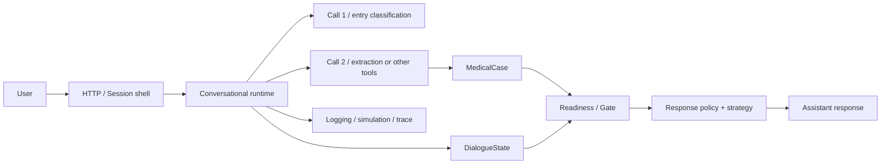

Dieses Bild ist schon besser als ein reiner Dateibaum,
aber noch nicht elementar genug.

## Reduktionspass

## Stufe 1: Alle Implementierungsdetails Ignorieren

Wenn man FastAPI,
Managernamen,
LLM-Call-Grenzen
und konkrete Modelle ausblendet,
bleibt Careena zunaechst nur dies:

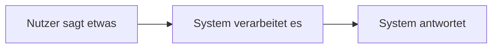

Das ist die aeusserste Huelle.
Damit ist aber noch nicht sichtbar,
warin Careena sich von einem beliebigen Chatbot unterscheidet.

## Stufe 2: Was Macht Das System Zwischen Nachricht Und Antwort

Der naechste sinnvolle Vereinfachungsschritt ist:

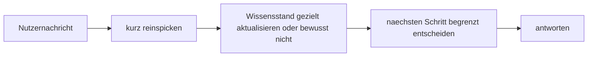

Das ist bereits die Grundform fast des ganzen Systems.

Careena ist also nicht einfach:

- Nachricht rein
- Text raus

Sondern:

- Nachricht kurz vorverarbeiten
- entscheiden,
  ob und wie tief weitere Verarbeitung noetig ist
- Zustand fortschreiben oder bewusst unveraendert lassen
- auf Basis kleiner Signale und strukturierter Lagen den naechsten Zug waehlen

## Stufe 3: Welche Art Von Wissen Wird Aktualisiert

Hier beginnt der Unterschied zwischen freiem KI-Chat und Careena.

Das System fuehrt nicht nur einen Verlauf,
sondern mehrere Arten von Wissen:

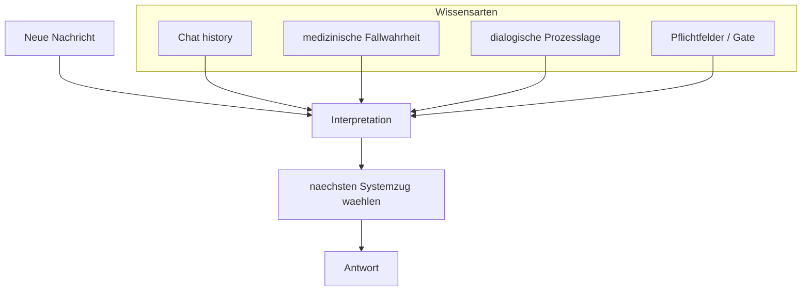

Schon hier wird sichtbar:

- Chat-Verlauf ist nicht genug
- `MedicalCase` ist nicht genug
- `Readiness` ist nicht genug
- die Antwort braucht eine uebergeordnete Lesart dieser Lagen

## Stufe 3.5: Der Mittelstreifen Zwischen Peek, Extraktion, Wahrheit Und Antwort

Genau hier sitzt der Teil,
der im Gesamtbild leicht untergeht,
obwohl er fuer Careena zentral ist:

- `Entry` schaut nur kurz in die Nachricht
- danach wird nicht automatisch immer gleich extrahiert
- und selbst bei Extraktion wird nicht automatisch alles direkt
  Fallwahrheit
- gleichzeitig darf die Antwort auch nicht frei aus dem Rohtext entstehen,
  sondern nur entlang erlaubter interner Bahnen

Reduziert sieht dieser Mittelstreifen so aus:

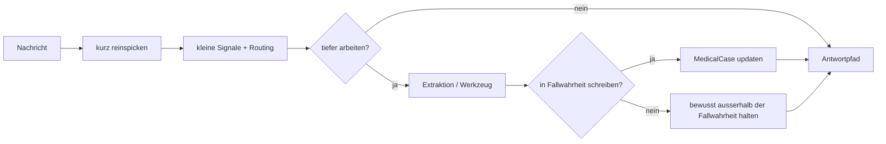

Das ist die eigentliche Steuerzone von Careena.

Sie entscheidet nicht den ganzen Fall,
aber sie begrenzt,
welche Art von Verarbeitung und welche Art von Antwort in diesem Turn
ueberhaupt zulaessig ist.

## Stufe 4: Was Ist Das Elementare Besondere Von Careena

Wenn man noch weiter reduziert,
bleibt der eigentliche Kern:

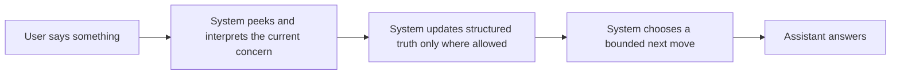

Das ist die elementare Grundstruktur.

Der entscheidende Unterschied zu einem normalen Chat ist:

- das System interpretiert nicht nur Text,
  sondern das aktuelle Nutzeranliegen
- es schreibt nicht nur Verlauf,
  sondern nur kontrolliert strukturierte Wahrheit
- es waehlt nicht nur eine fluessige Antwort,
  sondern einen begrenzten naechsten Zug

## Was Nach Der Reduktion Sichtbar Wird

Die Reduktion macht vier Wahrheiten sichtbar:

1. Careena ist vorn ein KI-Chat,
   hinten aber ein zustandsorientiertes Steuerungssystem
2. das aktuelle Nutzeranliegen ist nicht automatisch identisch mit
   erstem Symptom,
   `primary_focus`
   oder `recommendation_ready`
3. zwischen
   `kurz reinspicken`,
   `optional tiefer arbeiten`,
   `Wahrheit updaten oder nicht`
   und
   `begrenzt antworten`
   liegt die eigentliche Steuerzone des Systems
4. die wichtigste Architekturaufgabe ist nicht nur bessere Extraktion,
   sondern die richtige Ordnung zwischen
   Anliegen,
   medizinischer Wahrheit,
   Dialogsteuerung
   und Gate

## Wiederaufbau

Jetzt wird von dieser elementaren Form aus wieder aufgebaut.

## Wiederaufbau 1: Welche Schichten Braucht Careena Minimal

Wenn Careena den Auftrag hat,
ein Anliegen zu erfassen
und daraus spaeter Dringlichkeit oder Versorgungsempfehlung abzuleiten,
dann braucht das System minimal diese Bausteine:

1. eine Gespraechsflaeche
2. eine Interpretation des aktuellen Nutzeranliegens
3. medizinische Fallwahrheit
4. dialogische Steuerlage
5. Readiness- und Gate-Lage
6. eine Antwort- bzw. Reaktionsstrategie
7. spaeter Recommendation-Inhalt

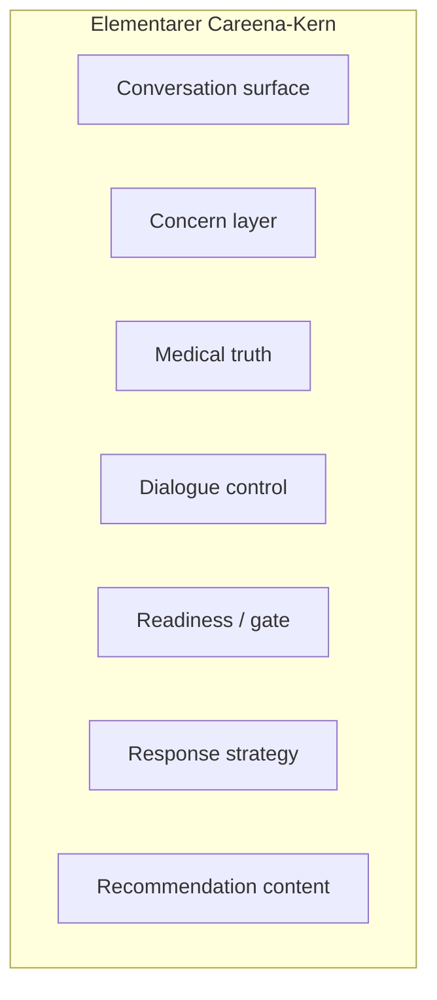

## Wiederaufbau 2: Das Allgemeine Sollbild

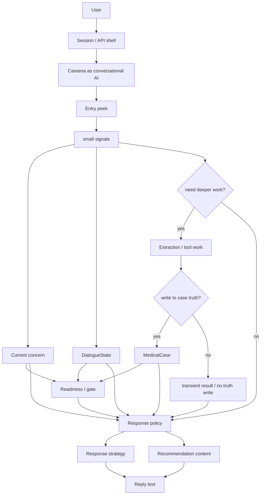

Hier ist die wesentliche Einsicht:

- `Concern`
  ist weder dasselbe wie `MedicalCase`
  noch dasselbe wie `DialogueState`
  noch dasselbe wie `Readiness`
- und zwischen `Entry` und Antwort liegt eine eigene Kontrollzone,
  die festlegt,
  ob Careena in diesem Turn nur kurz reagiert,
  extrahiert,
  Wahrheit schreibt,
  bewusst nichts schreibt
  oder in einen spaeteren Recommendation-Pfad uebergeht

## Wiederaufbau 3: Wo Call 1, Call 2 Und Spaeter Call 3 Reinpassen

Die LLM-Calls sind in diesem Bild keine Gesamtgehirne,
sondern Werkzeuge innerhalb der Schichten.

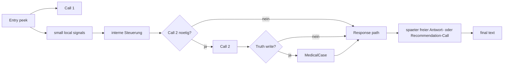

Das bedeutet:

- `Call 1` ordnet ein
- `Call 2` arbeitet nur dann tiefer,
  wenn die kleine Vorpruefung und die internen Signale das brauchen
- `Call 2` ist nicht gleichbedeutend mit
  `wir schreiben jetzt sicher in den Case`
- ein spaeterer freier Antwort- oder Recommendation-Call formuliert
  innerhalb schon gesetzter Grenzen

Die Architektur darf sich also nicht wieder so verhalten,
als waere das Modell selbst das eigentliche System.

## Wiederaufbau 3.5: Wie Der Mittelstreifen Heute Real In Der Runtime Laeuft

Das bisherige Bild war noch halb konzeptionell.
In der aktuellen Runtime ist der Mittelstreifen bereits recht konkret
verdrahtet.

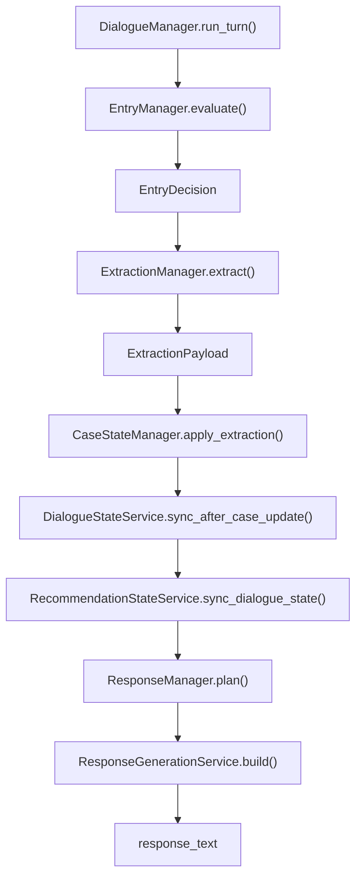

### 1. `DialogueManager` Haelt Den Lauf Sichtbar Zusammen

`DialogueManager.run_turn()` ist heute die klare Orchestrierungsmitte:

- uebernimmt den persistierten `MedicalCase`
  und `DialogueState`
- laesst fruehe Safety laufen
- ruft dann in fester Reihenfolge
  `Entry`,
  `Extraction`,
  `CaseState`,
  `DialogueState`,
  `RecommendationState`
  und `Response`
  auf

Wichtig:

- der Lauf ist immer gleich sichtbar
- aber nicht jeder Turn fuehrt in jeder Stufe zu tiefer Arbeit

### 2. `EntryManager` Ist Der Heutige Reale Peek

`EntryManager.evaluate()` ist heute genau das,
was du beschrieben hast:

- kurz reinspicken
- kleine Signale sammeln
- noch nicht breit medizinisch rekonstruieren

Konkret liefert `EntryDecision` u. a.:

- `extraction_required`
- `response_mode_hint`
- `recommendation_requested`
- `dialogue_transition_action`
- `call2_profile`
- `call2_tasks`
- `call2_operation_mode`

Wichtig:

- bei aktivem Recommendation-Abschlussknoten sitzt hier sogar noch vor dem
  normalen `Call 1` eine kleine Transition-Normalisierung
- erst danach wird der eigentliche Scout bzw.
  Intent-Gateway-Pfad gelesen

Das ist die reale Form von:

- wir spicken kurz rein
- und entscheiden dann,
  welche weitere Bahn ueberhaupt offen ist

### 3. `ExtractionManager` Ist Ein Optionaler Tiefenpfad

`ExtractionManager.extract()` fuehrt nicht automatisch immer einen
medizinischen Tiefencall aus.

Wenn `EntryDecision.extraction_required == False`,
liefert er nur:

- `ExtractionPayload(trace_notes=["extraction_skipped"])`

Wenn Extraktion noetig ist,
dann:

- ruft er den eigentlichen Extraktionsservice auf
- mappt das Ergebnis ueber den `ExtractionResultMapper`
  in einen `case_update_bridge`
- gibt daneben kleine Orchestrierungsdaten wie
  `active_modules`
  und `trace_notes`
  zurueck

Das ist wichtig,
weil es zeigt:

- `Call 2` ist nur ein optionaler Werkzeugpfad
- nicht die automatische Hauptwahrheit jedes Turns

### 4. Die Truth-Kante Liegt Heute Vor Allem In `CaseStateManager`

Der eigentliche Schritt
`schreiben wir das jetzt in die Fallwahrheit oder nicht`
ist heute vorhanden,
aber noch nicht als ganz eigener expliziter Schalter modelliert.

Real laeuft er so:

- `CaseStateManager.apply_extraction()` sorgt immer dafuer,
  dass ein `MedicalCase` existiert
- ein echter Truth-Write passiert aber nur,
  wenn `ExtractionPayload.case_update_bridge` vorhanden ist
- nur dann laeuft `CaseMerger.merge_delta(...)`
  und veraendert den kanonischen `MedicalCase`

Das heisst:

- `kein Call 2`
  bedeutet:
  kein Truth-Write
- `Call 2 ohne brauchbaren Bridge-Output`
  bedeutet ebenfalls:
  kein Truth-Write
- erst `Bridge vorhanden`
  oeffnet den Write in die kanonische Fallwahrheit

Genau hier sitzt also heute die reale Schwelle
`Truth write ja/nein`,
auch wenn sie noch nicht als eigener kleiner Vertrag benannt ist.

### 5. Nach Dem Truth-Write Kommen Erst Prozess Und Gate

Nach der Fallwahrheit lesen erst die spaeteren Zustandsschichten:

- `DialogueStateService.sync_after_case_update()`
- `RecommendationStateService.sync_dialogue_state()`

Das ist architektonisch wichtig,
weil es die Reihenfolge bestaetigt:

- erst optional Wahrheit fortschreiben
- dann Prozessfolgen ableiten
- dann Gate / Readiness ableiten

Nicht umgekehrt.

### 6. `ResponseManager` Waehlt Die Begrenzte Antwortbahn

`ResponseManager.plan()` liest heute den spaeten Zustand nicht frei,
sondern ueber einen kleinen expliziten Reaktionskern:

- `ResponseState`
  mit
  `safety_override`,
  `entry_response_hint`,
  `medical_state`,
  `transition_state`,
  `recommendation_state`

Daraus waehlt er die sichtbaren Bahnen:

- `emergency`
- `out_of_scope`
- `ask_followup`
- `cannot_assess`
- `guide_next_step`
- `continue`
- `recommend`

Das ist die konkrete Runtime-Form von:

- wir antworten nicht frei auf Rohtext
- wir antworten entlang einer kleinen begrenzten Pfadarchitektur

### 7. Die Antwortform Ist Noch Ein Zweiter Nachgeschalteter Filter

Selbst nach der Pfadwahl ist die Antwort nicht voellig frei.

`ResponseGenerationService.build()` unterscheidet heute:

- statische Antwort ueber `ResponseTextBuilder`
- engen freien Antwortpfad nur fuer `ResponseStrategy(kind="llm_continue")`

`LLMResponseGenerationService` ist damit heute bewusst kein Policy-Modul,
sondern nur ein spaeter Formulierer fuer den begrenzten `continue`-Pfad.

Das heisst:

- die grosse Mehrzahl der Bahnen bleibt hart begrenzt
- freiere LLM-Formulierung ist nur in einem engen Teil des Systems offen

## Wiederaufbau 3.6: Was Dieser Reale Lauf Ueber Careena Sagt

Wenn man die Runtime so liest,
ergibt sich fuer den Mittelstreifen heute bereits eine ziemlich klare
Funktionsform:

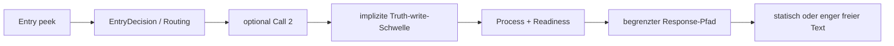

Das ist bereits sehr nah an deiner Produktlogik:

- Nutzer wirkt gegenueber ein Chat
- intern entscheidet ein kurzer Peek,
  was erlaubt ist
- nur ein Teil der Verarbeitung schreibt wirklich Fallwahrheit
- und nur ein Teil der Antwortpfade bekommt ueberhaupt etwas wie freie
  LLM-Formulierung

## Wiederaufbau 4: Die Aussenhuelle Ist Teil Des Systems

Das allgemeine Careena-System ist groesser als der Turn-Kern.

Es hat heute bereits sichtbare Aussenbausteine:

- HTTP/API-Schale in `server/careena3.py`
- Session-Speicher mit Verlauf,
  `MedicalCase`
  und `DialogueState`
- Simulationspfade
- Logging und Trace-Notizen

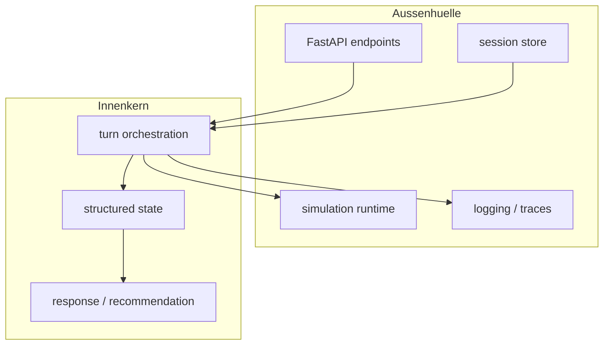

Diese Huelle ist nicht bloss Technik.
Sie bestimmt,
welche Wahrheiten ueber mehrere Nachrichten stabil gehalten werden
und wie sichtbar Systemfehler ueberhaupt werden.

## Drei Entwicklungsstufen Von Careena

Das Gesamtbild wird klarer,
wenn man nicht nur den Ist-Zustand,
sondern die Entwicklungsrichtung betrachtet:

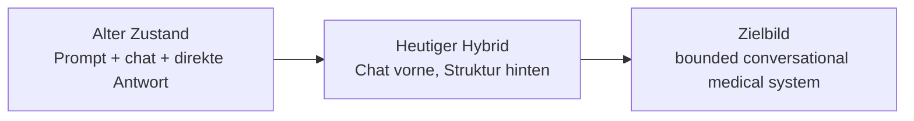

### Alter Zustand

- natuerlicher Chat
- geringe Nachvollziehbarkeit
- medizinisch riskant
- kaum strukturierte Steuerung

### Heutiger Hybrid

- sichtbarer Orchestrator
- strukturierte Wahrheits- und Prozessmodelle
- klare Sicherheits- und Recommendation-Ambition
- aber noch semantische Fehlverkabelungen

### Zielbild

- natuerlicher,
  aber begrenzter Dialog
- strukturierte und nachvollziehbare Innenlogik
- sauber getrennte Schichten
- spaeter adaptive,
  anliegengefuehrte Antwortstrategie

## Wie Der Aktuelle Code In Dieses Bild Faellt

### Was Schon Gut Traegt

- `server/careena3.py` macht die Produktschale klar sichtbar:
  Session,
  Chat-Endpunkt,
  Turn-Output,
  Recommendation-Output
- `DialogueManager` ist die erkennbare Orchestrierungsmitte
- `MedicalCase` ist als medizinischer Wahrheitsanker vorhanden
- `DialogueState` ist als Prozessspur vorhanden
- `AssessmentReadiness` ist als eigene Gate-Lage klein und lesbar
- Logging,
  Simulation
  und Trace-Notizen helfen,
  systemische Fehler sichtbar zu machen

### Was Nur Teilweise Passt

- `EntryManager`,
  `ResponseManager`
  und die Recommendation-Transition arbeiten schon an der richtigen Grenze,
  muessen aber fehlende uebergeordnete Semantik kompensieren
- die mittlere Steuerzone ist im Code funktional bereits vorhanden,
  aber im Gesamtbild noch nicht klar genug lesbar:
  `Entry` als kurzer Peek,
  `Call 2` als optionaler Tiefenpfad,
  Truth-Write als eigene Schwelle
  und Response als begrenzte spaete Bahn
- `ResponseStrategy` ist begonnen,
  aber noch nicht die eigentliche breite Antwortarchitektur
- Recommendation-Inhalt ist noch bewusst Placeholder

### Welche Mischstellen Der Reale Lauf Noch Hat

Gerade durch die Runtime-Abbildung werden ein paar Restmischungen sichtbar:

- die Schwelle
  `Truth write ja/nein`
  existiert real,
  steckt aber noch implizit in
  `case_update_bridge vorhanden oder nicht`
  statt als ganz eigener kleiner Vertrag
- `EntryManager`
  traegt zurecht den kurzen Peek,
  aber dort haengen bereits mehrere Kreuzungen zusammen:
  Transition-Normalisierung,
  Scout-Signale,
  Recommendation-Wunsch,
  Call-2-Modus
- `ResponseManager`
  hat inzwischen einen guten kleinen Reaktionskern,
  liest aber fuer obere Antwortbahnen weiter auf Signale,
  die spaeter teilweise concern-naeher interpretiert werden muessen
- der freie spaete Antwortpfad ist absichtlich eng,
  liest heute aber weiterhin u. a.
  `Primary Focus`
  und noch keine explizite concern-Lage

## Welche Ausreisser Die Architektur Aktuell Sichtbar Macht

## 1. Das Anliegen Fehlt Noch Als Eigene Lage

Das groesste allgemeine Problem ist nicht nur ein einzelner Bug,
sondern ein fehlender Systembaustein:

- das fortlaufende Nutzeranliegen

Heute wird diese Rolle teilweise verdeckt mitgetragen von:

- `primary_problem_id`
- `focus_observation_id`
- `focus_label`
- `recommendation_ready`
- lokalem Antwortpfad

Das ist zu viel Last fuer Bauteile,
die eigentlich andere Rollen haben.

## 2. `primary_focus` Traegt Zu Schnell Mehr Als Medizinischen Fokus

`primary_problem_id`
und daran angedockte Fokuspfade sind als medizinische Orientierung sinnvoll.

Sie werden aber problematisch,
wenn auf ihnen still diese weiteren Fragen mitlaufen:

- worum geht es dem Nutzer eigentlich gerade
- ist das Anliegen schon ausreichend verstanden
- darf man schon in Richtung Recommendation oder Abschluss gehen

## 3. `Readiness` Droht Zur Anliegen-Reife Uminterpretiert Zu Werden

`Readiness` ist systemisch wichtig,
aber semantisch enger:

- Pflichtfelder
- Mindestvoraussetzungen
- Gate fuer Recommendation-Schritte

Was `Readiness` nicht allein entscheiden sollte:

- ob das Nutzeranliegen inhaltlich schon hinreichend verstanden ist
- ob der Dialog fuer den Nutzer schon an einem natuerlichen Abschluss liegt

## 4. Antwortverhalten Ist Noch Zu Stark Von Kategorien Und Platzhaltern Gepraegt

Der Gesamtauftrag von Careena ist nicht,
nur bestimmte Kategorien mit festen Texten zu beantworten.

Die Architektur soll gerade ermoeglichen,
dass Careena:

- strukturiert denkt
- aber trotzdem sinnvoll und natuerlich antwortet

Wenn die innere Ordnung besser wird,
wird auch sichtbarer,
wo statische Antworten sinnvoll sind
und wo freie,
gebundene KI-Antworten andocken muessen.

## 4.5 Welche Antwortoptionen Es In Dieser Mittelzone Heute Schon Gibt

Zwischen `Entry`
und finaler Antwort gibt es heute nicht nur einen Pfad,
sondern mehrere erlaubte Varianten.

Reduziert:

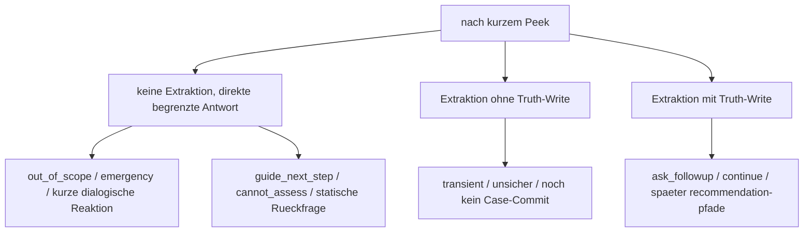

Ausgebaut fuer den heutigen Systemstand:

- `Entry` liefert nur kleine Signale und keine breite Fallrekonstruktion
- daraus folgt:
  `Call 2 ja oder nein`
- nach `Call 2` folgt:
  `Truth write ja oder nein`
- danach liest die Response-Schicht den Zustand und waehlt heute u. a.:
  `emergency`,
  `out_of_scope`,
  `cannot_assess`,
  `ask_followup`,
  `guide_next_step`,
  `continue`,
  `recommend`
- die Antwort selbst kann dabei je nach Pfad
  statisch,
  enger frei formuliert
  oder recommendation-nah sein

Genau diese Vielfalt sollte im Gesamtbild sichtbar bleiben,
weil sie zeigt,
dass Careena nicht aus einem einzigen linearen LLM-Rohr besteht,
sondern aus begrenzten Antwortbahnen.

## 5. Entry Und Transition Kompensieren Noch Fehlende Ueberbau-Semantik

Dass `EntryManager` und Recommendation-Transition heute so wichtig wirken,
ist kein Zufall.

Dort treffen sich gerade:

- Oberflaechenwahl
- freier Text
- medizinische Fortsetzung
- Recommendation-Wunsch
- dialogischer Rueckweg

Wenn das Anliegen nicht als eigene Lage mitgefuehrt wird,
muessen diese Schichten zu viel indirekt erraten.

## 5.5 Der Mittelstreifen Ist Eigentlich Der Steuerkern

Die tiefere Lesart lautet deshalb:

- `Entry`
  ist kein Mini-Parser,
  der schon viel wissen soll
- `Call 2`
  ist kein automatischer Wahrheitsgenerator
- `MedicalCase`
  ist nicht die einzige relevante Zwischenstation
- `Response`
  ist kein freies Nachsprechen des Modells

Sondern:

- `Entry` spickt kurz rein
- die mittlere Steuerzone begrenzt,
  welche weitere Arbeit erlaubt ist
- nur ein Teil davon wird in Fallwahrheit ueberfuehrt
- erst danach wird entlang erlaubter Antwortbahnen reagiert

## 6. Die Aussenhuelle Ist Relativ Klarer Als Teile Des Innenkerns

Interessanterweise wirkt das grosse System von aussen an manchen Stellen
schon klarer als der semantische Innenkern:

- Session existiert
- Ein- und Ausgabe existieren
- Turn-Orchestrierung existiert
- Simulation und Logs existieren

Unscharf ist derzeit staerker:

- was genau als Anliegen gilt
- wann das Anliegen nur fortgefuehrt wird
- wann es in einen neuen medizinischen Fokus kippt
- wie Readiness und Antwortstrategie darauf lesen sollen

## Bild 2: Vermutete Hauptspannung Im Aktuellen System

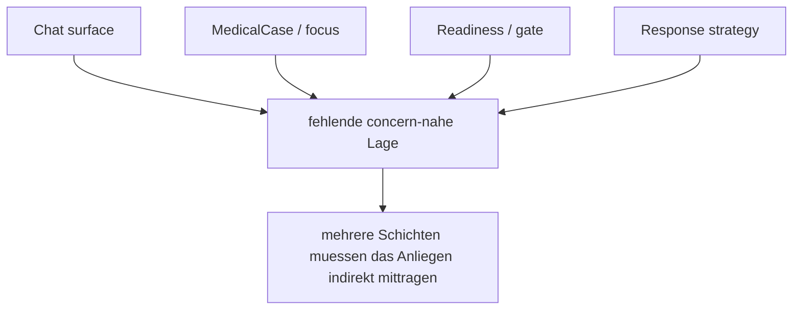

## Elementare Definition In Einem Satz

Careena ist im Kern kein Symptom-Chat mit spaeterer Empfehlung,
sondern ein KI-gefuehrtes,
zustandsorientiertes Medizinsystem,
das freie Nutzernachrichten in eine begrenzte Architektur aus
Anliegen,
medizinischer Wahrheit,
Dialogsteuerung,
Gate
und spaeter Recommendation ueberfuehrt.

## Was Daraus Fuer Unser Architekturverstaendnis Folgt

1. Die Vorderseite von Careena darf chatartig bleiben.
2. Die Rueckseite muss nicht chatartig sein,
   sondern klar geschichtet.
3. `MedicalCase` ist nicht das ganze System.
4. `DialogueState` ist nicht das ganze System.
5. `Readiness` ist nicht das ganze System.
6. Das Nutzeranliegen ist wahrscheinlich die fehlende Uebergangsschicht
   zwischen freiem Chat und strukturierter Fall-/Dialoglogik.

## Was Als Naechstes An Der Architekturbrille Wichtig Ist

Noch keine direkte Umbauanweisung,
aber eine klare Synchronisationslinie:

1. Careena weiter als Gesamtsystem lesen,
   nicht nur als Folge von Turn-Managern
2. die concern-nahe Lage explizit machen,
   ohne sie vorschnell mit `DialogueState` oder `Readiness` zu verschmelzen
3. den Mittelstreifen
   `Entry peek -> Routing -> optional Call 2 -> Truth write oder nicht ->
   Response-Pfad`
   als eigene Steuerzone expliziter lesen
4. bestehende `primary_focus`-gekoppelte Pfade daraufhin pruefen,
   ob sie medizinischen Fokus
   oder verdeckte Anliegen-Semantik tragen
5. Antwortstrategie und Recommendation danach als obere,
   nicht als rohe symptomnahe Schichten weiterziehen

## Schlussbild

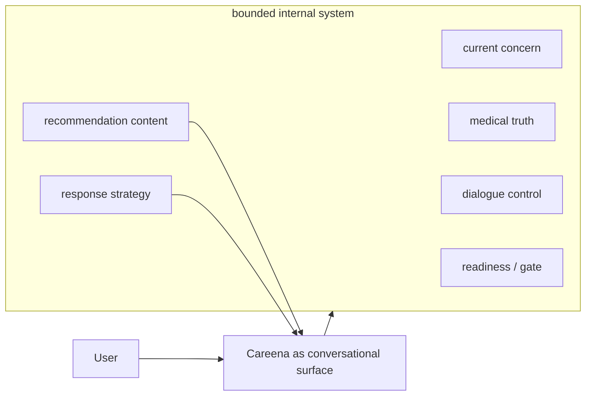

Wenn dieses Bild stimmt,
dann ist die aktuelle Hauptaufgabe nicht bloss,
ein paar Antworttexte zu reparieren.

Die eigentliche Aufgabe ist,
das allgemeine Careena-System so zu ordnen,
dass der freie Chat vorne
und die strukturierte medizinische Steuerung hinten
wirklich sauber zusammenarbeiten.
