# Careena Architecture Reduction And Rebuild Concept

Stand: 2026-06-12
Status: working concept

## Zweck

Diese Datei betrachtet bewusst das allgemeine System von Careena
und nicht nur den engeren Turn-Kern von `careena_pipeline3`.

Sie soll zwei Dinge gleichzeitig leisten:

1. den aktuellen Gesamtaufbau von Careena sichtbar machen
2. ihn so weit vereinfachen,
   bis die elementare Grundstruktur klar wird,
   und ihn dann wieder sinnvoll aufbauen

Das Ziel ist nicht primaer ein weiterer Refactor-Plan.
Das Ziel ist Synchronisierung:

- was Careena eigentlich als System ist
- welche Schichten dafuer wirklich gebraucht werden
- welche aktiven Bauteile schon gut passen
- welche Teile aktuell semantisch schief sitzen

## Ausgangslage

Careena ist historisch nicht als voll modelliertes Medizinsystem gestartet,
sondern eher als freier KI-Chat mit Master Prompt.

Das sieht man noch gut am aelteren Pfad in `server/chat/logic.py`:

- Session halten
- grob Off-Topic und Red Flags pruefen
- Prompt plus Chat-Historie ans LLM geben
- Antwort direkt zurueckgeben

Das war einfach,
wirkte natuerlicher,
war aber medizinisch und architektonisch zu wenig kontrolliert:

- keine saubere Trennung zwischen Chat und Fallwahrheit
- kaum nachvollziehbare Zwischenentscheidungen
- medizinische Ableitungen lagen faktisch im Modell
- Recommendation,
  Follow-up
  und Gespraechssteuerung waren nicht sauber explizit

`careena_pipeline3` ist der Gegenentwurf dazu:

- der Chat bleibt die sichtbare Vorderseite
- im Hintergrund werden aber strukturierte Zustandslagen aufgebaut
- diese begrenzen,
  fuehren
  und spaeter legitimieren,
  was Careena antworten darf

## Bild 1: Careena Als Gesamtsystem Heute

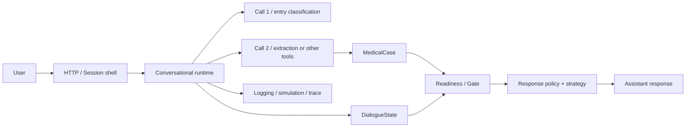

Dieses Bild ist schon besser als ein reiner Dateibaum,
aber noch nicht elementar genug.

## Reduktionspass

## Stufe 1: Alle Implementierungsdetails Ignorieren

Wenn man FastAPI,
Managernamen,
LLM-Call-Grenzen
und konkrete Modelle ausblendet,
bleibt Careena zunaechst nur dies:

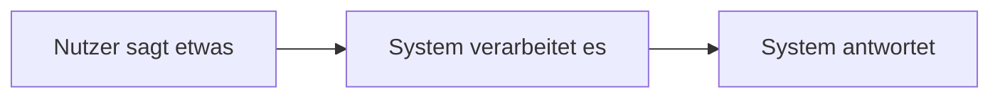

Das ist die aeusserste Huelle.
Damit ist aber noch nicht sichtbar,
warin Careena sich von einem beliebigen Chatbot unterscheidet.

## Stufe 2: Was Macht Das System Zwischen Nachricht Und Antwort

Der naechste sinnvolle Vereinfachungsschritt ist:

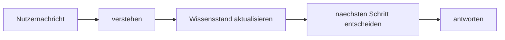

Das ist bereits die Grundform fast des ganzen Systems.

Careena ist also nicht einfach:

- Nachricht rein
- Text raus

Sondern:

- Nachricht deuten
- Zustand fortschreiben
- auf Basis dieses Zustands den naechsten Zug waehlen

## Stufe 3: Welche Art Von Wissen Wird Aktualisiert

Hier beginnt der Unterschied zwischen freiem KI-Chat und Careena.

Das System fuehrt nicht nur einen Verlauf,
sondern mehrere Arten von Wissen:

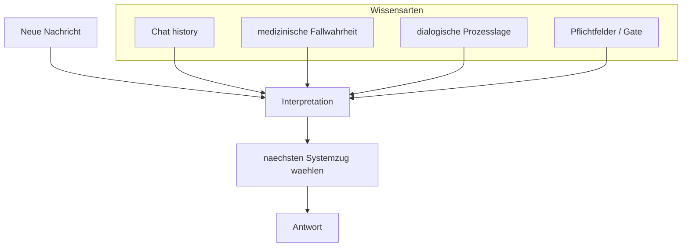

Schon hier wird sichtbar:

- Chat-Verlauf ist nicht genug
- `MedicalCase` ist nicht genug
- `Readiness` ist nicht genug
- die Antwort braucht eine uebergeordnete Lesart dieser Lagen

## Stufe 4: Was Ist Das Elementare Besondere Von Careena

Wenn man noch weiter reduziert,
bleibt der eigentliche Kern:

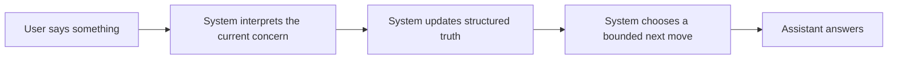

Das ist die elementare Grundstruktur.

Der entscheidende Unterschied zu einem normalen Chat ist:

- das System interpretiert nicht nur Text,
  sondern das aktuelle Nutzeranliegen
- es schreibt nicht nur Verlauf,
  sondern strukturierte Wahrheit
- es waehlt nicht nur eine fluessige Antwort,
  sondern einen begrenzten naechsten Zug

## Was Nach Der Reduktion Sichtbar Wird

Die Reduktion macht drei Wahrheiten sichtbar:

1. Careena ist vorn ein KI-Chat,
   hinten aber ein zustandsorientiertes Steuerungssystem
2. das aktuelle Nutzeranliegen ist nicht automatisch identisch mit
   erstem Symptom,
   `primary_focus`
   oder `recommendation_ready`
3. die wichtigste Architekturaufgabe ist nicht nur bessere Extraktion,
   sondern die richtige Ordnung zwischen
   Anliegen,
   medizinischer Wahrheit,
   Dialogsteuerung
   und Gate

## Wiederaufbau

Jetzt wird von dieser elementaren Form aus wieder aufgebaut.

## Wiederaufbau 1: Welche Schichten Braucht Careena Minimal

Wenn Careena den Auftrag hat,
ein Anliegen zu erfassen
und daraus spaeter Dringlichkeit oder Versorgungsempfehlung abzuleiten,
dann braucht das System minimal diese Bausteine:

1. eine Gespraechsflaeche
2. eine Interpretation des aktuellen Nutzeranliegens
3. medizinische Fallwahrheit
4. dialogische Steuerlage
5. Readiness- und Gate-Lage
6. eine Antwort- bzw. Reaktionsstrategie
7. spaeter Recommendation-Inhalt

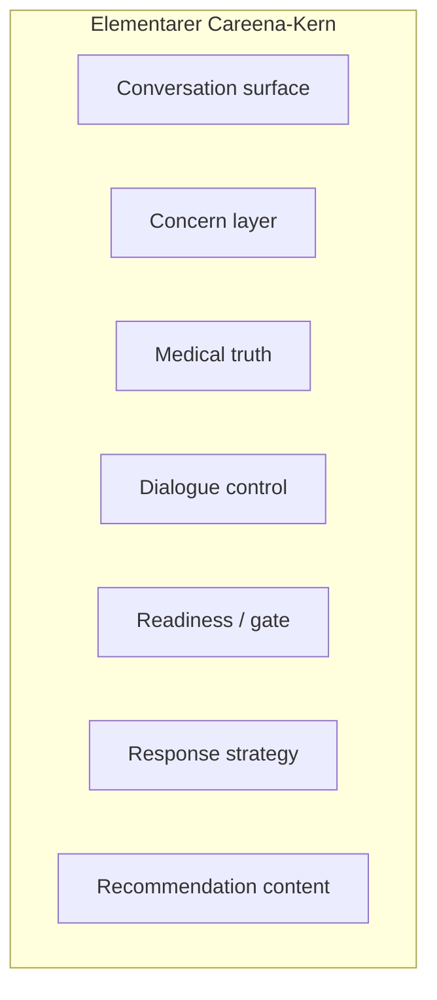

## Wiederaufbau 2: Das Allgemeine Sollbild

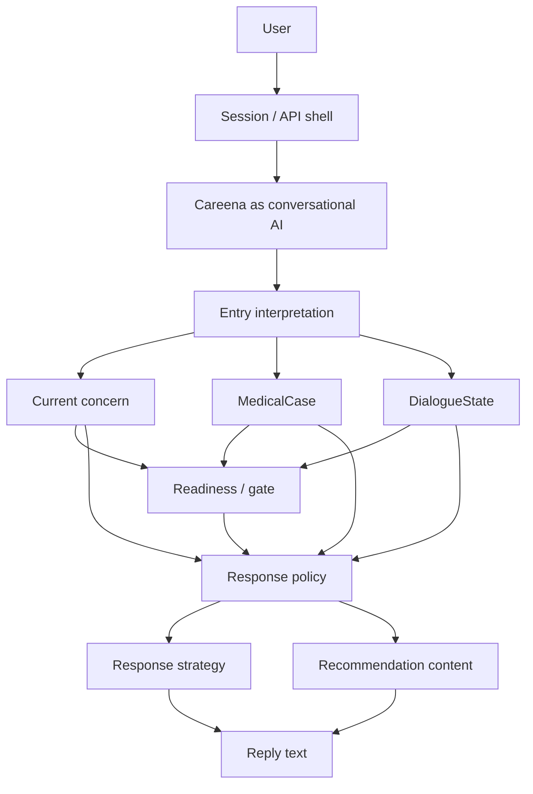

Hier ist die wesentliche Einsicht:

- `Concern`
  ist weder dasselbe wie `MedicalCase`
  noch dasselbe wie `DialogueState`
  noch dasselbe wie `Readiness`

## Wiederaufbau 3: Wo Call 1, Call 2 Und Spaeter Call 3 Reinpassen

Die LLM-Calls sind in diesem Bild keine Gesamtgehirne,
sondern Werkzeuge innerhalb der Schichten.

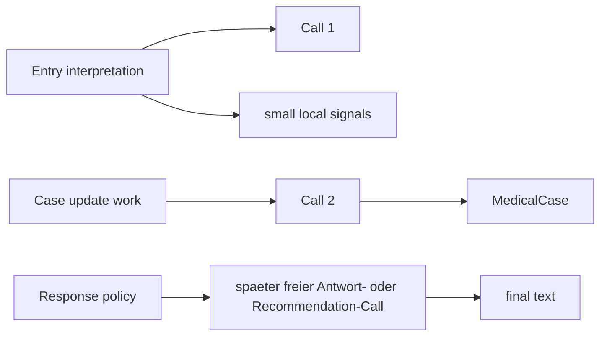

Das bedeutet:

- `Call 1` ordnet ein
- `Call 2` arbeitet medizinisch
- ein spaeterer freier Antwort- oder Recommendation-Call formuliert
  innerhalb schon gesetzter Grenzen

Die Architektur darf sich also nicht wieder so verhalten,
als waere das Modell selbst das eigentliche System.

## Wiederaufbau 4: Die Aussenhuelle Ist Teil Des Systems

Das allgemeine Careena-System ist groesser als der Turn-Kern.

Es hat heute bereits sichtbare Aussenbausteine:

- HTTP/API-Schale in `server/careena3.py`
- Session-Speicher mit Verlauf,
  `MedicalCase`
  und `DialogueState`
- Simulationspfade
- Logging und Trace-Notizen

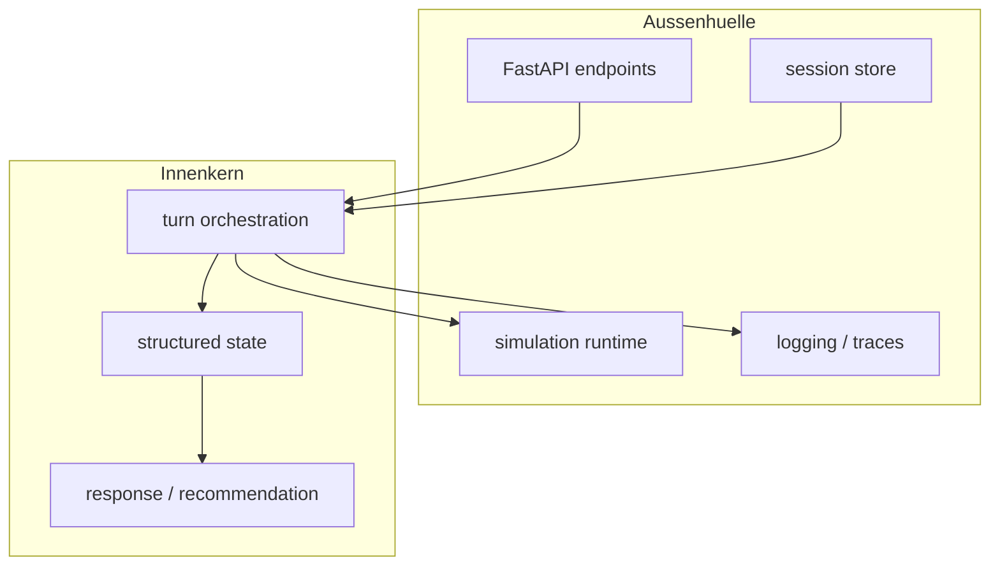

Diese Huelle ist nicht bloss Technik.
Sie bestimmt,
welche Wahrheiten ueber mehrere Nachrichten stabil gehalten werden
und wie sichtbar Systemfehler ueberhaupt werden.

## Drei Entwicklungsstufen Von Careena

Das Gesamtbild wird klarer,
wenn man nicht nur den Ist-Zustand,
sondern die Entwicklungsrichtung betrachtet:

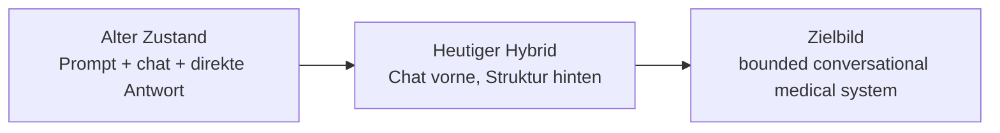

### Alter Zustand

- natuerlicher Chat
- geringe Nachvollziehbarkeit
- medizinisch riskant
- kaum strukturierte Steuerung

### Heutiger Hybrid

- sichtbarer Orchestrator
- strukturierte Wahrheits- und Prozessmodelle
- klare Sicherheits- und Recommendation-Ambition
- aber noch semantische Fehlverkabelungen

### Zielbild

- natuerlicher,
  aber begrenzter Dialog
- strukturierte und nachvollziehbare Innenlogik
- sauber getrennte Schichten
- spaeter adaptive,
  anliegengefuehrte Antwortstrategie

## Wie Der Aktuelle Code In Dieses Bild Faellt

### Was Schon Gut Traegt

- `server/careena3.py` macht die Produktschale klar sichtbar:
  Session,
  Chat-Endpunkt,
  Turn-Output,
  Recommendation-Output
- `DialogueManager` ist die erkennbare Orchestrierungsmitte
- `MedicalCase` ist als medizinischer Wahrheitsanker vorhanden
- `DialogueState` ist als Prozessspur vorhanden
- `AssessmentReadiness` ist als eigene Gate-Lage klein und lesbar
- Logging,
  Simulation
  und Trace-Notizen helfen,
  systemische Fehler sichtbar zu machen

### Was Nur Teilweise Passt

- `EntryManager`,
  `ResponseManager`
  und die Recommendation-Transition arbeiten schon an der richtigen Grenze,
  muessen aber fehlende uebergeordnete Semantik kompensieren
- `ResponseStrategy` ist begonnen,
  aber noch nicht die eigentliche breite Antwortarchitektur
- Recommendation-Inhalt ist noch bewusst Placeholder

## Welche Ausreisser Die Architektur Aktuell Sichtbar Macht

## 1. Das Anliegen Fehlt Noch Als Eigene Lage

Das groesste allgemeine Problem ist nicht nur ein einzelner Bug,
sondern ein fehlender Systembaustein:

- das fortlaufende Nutzeranliegen

Heute wird diese Rolle teilweise verdeckt mitgetragen von:

- `primary_problem_id`
- `focus_observation_id`
- `focus_label`
- `recommendation_ready`
- lokalem Antwortpfad

Das ist zu viel Last fuer Bauteile,
die eigentlich andere Rollen haben.

## 2. `primary_focus` Traegt Zu Schnell Mehr Als Medizinischen Fokus

`primary_problem_id`
und daran angedockte Fokuspfade sind als medizinische Orientierung sinnvoll.

Sie werden aber problematisch,
wenn auf ihnen still diese weiteren Fragen mitlaufen:

- worum geht es dem Nutzer eigentlich gerade
- ist das Anliegen schon ausreichend verstanden
- darf man schon in Richtung Recommendation oder Abschluss gehen

## 3. `Readiness` Droht Zur Anliegen-Reife Uminterpretiert Zu Werden

`Readiness` ist systemisch wichtig,
aber semantisch enger:

- Pflichtfelder
- Mindestvoraussetzungen
- Gate fuer Recommendation-Schritte

Was `Readiness` nicht allein entscheiden sollte:

- ob das Nutzeranliegen inhaltlich schon hinreichend verstanden ist
- ob der Dialog fuer den Nutzer schon an einem natuerlichen Abschluss liegt

## 4. Antwortverhalten Ist Noch Zu Stark Von Kategorien Und Platzhaltern Gepraegt

Der Gesamtauftrag von Careena ist nicht,
nur bestimmte Kategorien mit festen Texten zu beantworten.

Die Architektur soll gerade ermoeglichen,
dass Careena:

- strukturiert denkt
- aber trotzdem sinnvoll und natuerlich antwortet

Wenn die innere Ordnung besser wird,
wird auch sichtbarer,
wo statische Antworten sinnvoll sind
und wo freie,
gebundene KI-Antworten andocken muessen.

## 5. Entry Und Transition Kompensieren Noch Fehlende Ueberbau-Semantik

Dass `EntryManager` und Recommendation-Transition heute so wichtig wirken,
ist kein Zufall.

Dort treffen sich gerade:

- Oberflaechenwahl
- freier Text
- medizinische Fortsetzung
- Recommendation-Wunsch
- dialogischer Rueckweg

Wenn das Anliegen nicht als eigene Lage mitgefuehrt wird,
muessen diese Schichten zu viel indirekt erraten.

## 6. Die Aussenhuelle Ist Relativ Klarer Als Teile Des Innenkerns

Interessanterweise wirkt das grosse System von aussen an manchen Stellen
schon klarer als der semantische Innenkern:

- Session existiert
- Ein- und Ausgabe existieren
- Turn-Orchestrierung existiert
- Simulation und Logs existieren

Unscharf ist derzeit staerker:

- was genau als Anliegen gilt
- wann das Anliegen nur fortgefuehrt wird
- wann es in einen neuen medizinischen Fokus kippt
- wie Readiness und Antwortstrategie darauf lesen sollen

## Bild 2: Vermutete Hauptspannung Im Aktuellen System

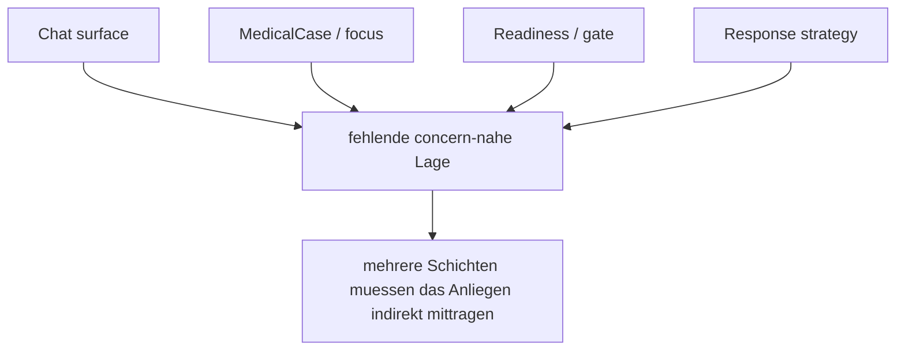

## Elementare Definition In Einem Satz

Careena ist im Kern kein Symptom-Chat mit spaeterer Empfehlung,
sondern ein KI-gefuehrtes,
zustandsorientiertes Medizinsystem,
das freie Nutzernachrichten in eine begrenzte Architektur aus
Anliegen,
medizinischer Wahrheit,
Dialogsteuerung,
Gate
und spaeter Recommendation ueberfuehrt.

## Was Daraus Fuer Unser Architekturverstaendnis Folgt

1. Die Vorderseite von Careena darf chatartig bleiben.
2. Die Rueckseite muss nicht chatartig sein,
   sondern klar geschichtet.
3. `MedicalCase` ist nicht das ganze System.
4. `DialogueState` ist nicht das ganze System.
5. `Readiness` ist nicht das ganze System.
6. Das Nutzeranliegen ist wahrscheinlich die fehlende Uebergangsschicht
   zwischen freiem Chat und strukturierter Fall-/Dialoglogik.

## Was Als Naechstes An Der Architekturbrille Wichtig Ist

Noch keine direkte Umbauanweisung,
aber eine klare Synchronisationslinie:

1. Careena weiter als Gesamtsystem lesen,
   nicht nur als Folge von Turn-Managern
2. die concern-nahe Lage explizit machen,
   ohne sie vorschnell mit `DialogueState` oder `Readiness` zu verschmelzen
3. bestehende `primary_focus`-gekoppelte Pfade daraufhin pruefen,
   ob sie medizinischen Fokus
   oder verdeckte Anliegen-Semantik tragen
4. Antwortstrategie und Recommendation danach als obere,
   nicht als rohe symptomnahe Schichten weiterziehen

## Schlussbild

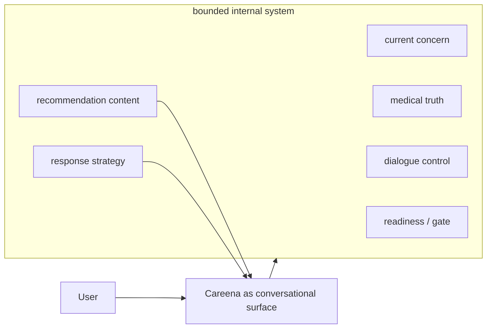

Wenn dieses Bild stimmt,
dann ist die aktuelle Hauptaufgabe nicht bloss,
ein paar Antworttexte zu reparieren.

Die eigentliche Aufgabe ist,
das allgemeine Careena-System so zu ordnen,
dass der freie Chat vorne
und die strukturierte medizinische Steuerung hinten
wirklich sauber zusammenarbeiten.
