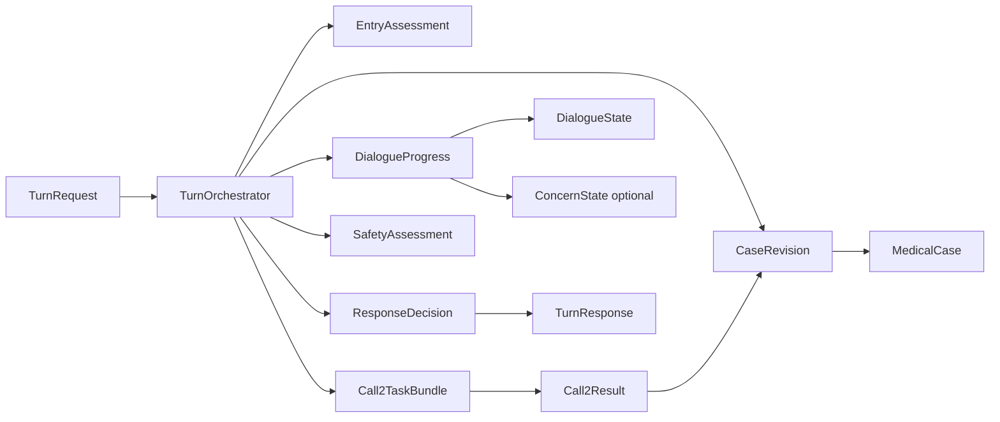

# Careena Pipeline 3 Target Architecture Object Model

Stand: 2026-06-12
Status: working concept

## Zweck

Diese Datei haelt ein Soll-Zielbild fuer die Objektstruktur von
`careena_pipeline3` fest.

Der Fokus liegt bewusst nicht auf einzelnen Klassen oder Dateinamen,
sondern auf den semantischen Eigentuemern von Zustand und Ableitungen:

- was ist persistente Wahrheit
- was ist nur turn-lokale Berechnung
- was ist Dialogprozess
- was ist Antwortentscheidung
- welche heutigen Objekte sind dafuer zu breit oder doppelt geschnitten

## Ausgangspunkt

Der aktuelle Code hat bereits eine gut sichtbare Turn-Orchestrierung.

Gleichzeitig sind mehrere Modellwelten ineinander geschoben:

- `TurnContext` als Arbeitskontext, State-Schatten und Ergebniscontainer
- `DialogueState` als persistenter Gespraechsprozess
- `MedicalCase` als kanonische medizinische Wahrheit
- mehrere Stage-Outputs, von denen einige schon klar sind
  und andere noch stark transitional wirken

Das fuehrt zu zwei Hauptproblemen:

1. `Turn` und `Dialogue` ueberlappen semantisch zu stark
2. einige Objekte sind eher Sammelcontainer als klare Vertraege

Zusaetzlich gibt es eine technische Schieflage in der Mitte der Pipeline:

- `Call 2` ist aktuell noch nicht sauber als technischer Werkzeugkasten
  modelliert
- dadurch wirkt `Extraction` breiter,
  als sie im Zielbild eigentlich sein sollte
- `Call 2` ist nicht identisch mit `Extraction`
- `Extraction` ist nur eine moegliche Aufgabe innerhalb von `Call 2`

## Kernannahme

Das System sollte langfristig nicht drei gleich starke Fachzentren haben,
sondern zwei persistente Wahrheitszentren plus eine schlanke
Verarbeitungshuelse:

- `MedicalCase` fuer medizinische Wahrheit
- `DialogueState` fuer Gespraechsprozess
- `Turn` nur als Ausfuehrungseinheit fuer eine einzelne Nachricht

`ConcernState` ist damit kein automatisch gesetztes drittes Zentrum,
sondern eine offene Architekturfrage.

Es darf nur als eigenstaendige persistente Sicht bestehen bleiben,
wenn diese Perspektive fachlich wirklich etwas anderes modelliert als:

- medizinisches Anliegen im `MedicalCase`
- Gespraechsprozess im `DialogueState`

## Careena Als Zielsystem

Die Aufgabe von Careena ist in dieser Sicht nicht einfach,
medizinische Fakten lose zu sammeln.

Die Aufgabe ist:

1. ein anwendungsrelevantes medizinisches Anliegen des Patienten erfassen
2. den Dialog so fuehren,
   dass fuer dieses Anliegen genug belastbare Informationen entstehen
3. auf dieser Basis zu einer Versorgungsempfehlung gelangen

Das hat direkte Folgen fuer die Modellierung:

- nicht jedes geaeusserte Anliegen gehoert automatisch in den `MedicalCase`
- ein Anliegen darf nur dann in den `MedicalCase`,
  wenn es in den Anwendungskontext von Careena passt
- wenn es nicht in den Anwendungskontext passt,
  ist es kein medizinischer Fallkern fuer Careena
- `Readiness` soll nicht abstrakt pruefen,
  ob "genug Daten" vorhanden sind
- `Readiness` soll pruefen,
  ob fuer das aktuell relevante medizinische Anliegen genug belastbare
  Information vorhanden ist,
  um den naechsten erlaubten Schritt in Richtung Versorgungsempfehlung
  zu gehen

## Soll-Zielbild

### Persistente Wahrheitszentren

- `MedicalCase`
- `DialogueState`

### Turn-lokale Verarbeitungsobjekte

- `TurnRequest`
- `TurnWorkState`
- `EntryAssessment`
- `ClinicalUpdate`
- `SafetyAssessment`
- `ReadinessAssessment`
- `ResponseDecision`
- `TurnResponse`

### Offene optionale persistente Sicht

- `ConcernState`
  - nur falls spaeter klar wird,
    dass Careena eine dritte persistente Sicht braucht,
    die weder medizinische Wahrheit noch Dialogprozess ist

Die Regel dahinter:

- alles, was nach dem Turn weiterlebt, gehoert in `MedicalCase`,
  `DialogueState` oder `ConcernState`
- alles, was nur waehrend der Verarbeitung entsteht,
  ist Stage-Output oder interner Turn-Arbeitszustand

## Zielarchitektur Im Ueberblick

Wichtig:

- `ResponseDecision` haengt explizit von `MedicalCase`,
  `DialogueState`
  und gegebenenfalls `ConcernState` ab
- `ResponseDecision` besitzt diese Zustaende aber nicht,
  sondern liest sie nur
- `Turn` ist hier keine dritte grosse Fachwahrheit,
  sondern nur die Ausfuehrungsform

## Application-Fit Vor Case-Aufnahme

Ein wichtiger Grenzsatz fuer das Zielbild ist:

- nicht jedes Nutzeranliegen wird automatisch Teil des `MedicalCase`

Stattdessen braucht Careena vor oder waehrend der Fallaufnahme eine kleine
Passungspruefung:

- passt das geaeusserte Anliegen in den Anwendungsrahmen von Careena
- ist es medizinisch relevant genug,
  um als aktives Anliegen weiterverfolgt zu werden
- kann Careena dazu sinnvoll einen versorgungsbezogenen Dialog fuehren

Erst wenn diese Huerde genommen ist,
soll das Anliegen als aktiver Fallkern in den `MedicalCase`.

Der `MedicalCase` enthaelt dann nicht bloss Einzelbeobachtungen,
sondern das medizinisch relevante Anliegen plus die zugehoerigen
extrahierten und spaeter ergaenzten Informationen.

## Semantische Eigentuemerschaft

### 1. Gehoert Zu Turn

Diese Objekte sind fluechtig.
Sie sind entweder Eingabe,
Ausgabe
oder abgeleitete Laufzeitobjekte eines einzelnen Turns.

- `TurnRequest`
  - aktuelle Nutzernachricht
  - Conversation History
  - Referenzen auf bestehende persistente Zustaende
- `TurnResponse`
  - finaler Antworttext
  - Response Mode
  - optional Recommendation Payload
- `TurnWorkState`
  - kleiner interner Arbeitsspeicher des Orchestrators
  - enthaelt nur das,
    was waehrend eines Turns zur Weitergabe zwischen Stages gebraucht wird
- `EntryAssessment`
  - Ergebnis des Turn-Einstiegs
  - etwa:
    application fit,
    extraction required,
    recommendation requested,
    person context,
    off-topic hint
- `Call2TaskBundle`
  - turn-lokales Aufgabenpaket fuer den technischen Ausfuehrungsraum `Call 2`
- `Call2Result`
  - turn-lokales Ergebnis des technischen Ausfuehrungsraums `Call 2`
- `ClinicalUpdate`
  - moegliches medizinisches Delta aus der aktuellen Nachricht
  - nicht gleichzusetzen mit `Call 2`
- `SafetyAssessment`
  - konsolidierte Safety-Sicht fuer diesen Turn
- `ReadinessAssessment`
  - explizite Bewertung,
    ob fuer das aktive Careena-kompatible Anliegen der naechste
    versorgungsbezogene Schritt fachlich/prozessual freigegeben ist
- `ResponseDecision`
  - spaete kommunikative Entscheidung auf Basis persistenter Zustaende

### 2. Gehoert Zu Dialogue

Alles,
was ueber mehrere Turns den Gespraechsprozess beschreibt.

- `DialogueState`
- `PendingFollowup`
- `PendingDialogueTransition`
- `resolved_requirements`
- `recommendation_requested`
- `recommendation_ready`
- Gespraechsphasen oder weitere Prozessmarker,
  falls spaeter noetig

Faustregel:

- wenn eine Information beschreibt,
  was im Gespraech noch offen ist
  oder welcher dialogische Zustand gerade gilt,
  dann gehoert sie in `DialogueState`

### 3. Gehoert Zu Case

Alles,
was medizinische Wahrheit oder medizinisch interpretierte Nutzersignale
abbildet.

- `MedicalCase`
- aktives medizinisches Anliegen,
  sofern es in den Anwendungskontext passt
- `Subject`
- `CaseObservation`
- aktive Beobachtungen
- negierte Beobachtungen
- Primary Focus / Problemfokus
- medizinische Befunde,
  Symptome,
  Diagnosen,
  Medikamente,
  Verletzungen,
  Messwerte

Zusaetzlich sinnvoll als explizite Stage-Objekte:

- `ClinicalUpdate`
  - semantisch turn-lokal,
    aber fachlich klar auf der Case-Seite verankert
- `CaseRevision`
  - Ergebnis eines angewandten medizinischen Deltas auf das bestehende
    `MedicalCase`

Wichtig:

- das Anliegen gehoert in den `MedicalCase`,
  wenn es fuer Careena medizinisch relevant und anwendungsgeeignet ist
- das Anliegen gehoert nicht in den `MedicalCase`,
  wenn es am Anwendungskontext vorbeigeht
- `MedicalCase` soll also nicht jede beliebige Gespraechsabsicht spiegeln,
  sondern nur den fachlich relevanten Fallkern

### 4. Gehoert Zu Concern

`ConcernState` ist die offenste Designfrage im Zielbild.

Wenn `ConcernState` beibehalten wird,
dann nur als eigenstaendige persistente Sicht fuer Sorge,
Priorisierung
oder emotionale Relevanz,
die weder im `MedicalCase` noch im `DialogueState` gut aufgehoben ist.

- `ConcernState`
- concern summary
- linked observation ids
- spaetere concern-spezifische Priorisierungen oder Fokussignale

Wichtig:

- `ConcernState` ist nicht einfach ein zweites `DialogueState`
- `ConcernState` ist kein Ersatz fuer medizinische Wahrheit
- das medizinische Anliegen selbst gehoert primaer in den `MedicalCase`
- `ConcernState` waere nur dann richtig,
  wenn zusaetzlich etwas wie subjektive Sorge,
  priorisierte Befuerchtung
  oder emotionale Problemgewichtung langfristig modelliert werden soll
- wenn diese dritte Sicht nicht wirklich gebraucht wird,
  sollte `ConcernState` eher wegfallen als kuenstlich erhalten werden

### 5. Gehoert Zu Response

Diese Objekte sind keine persistente Wahrheit,
sondern spaete abgeleitete Antwortartefakte.

- `ResponseDecision`
- `ResponseStrategy`
- `RecommendationPayload` oder `RecommendationResult`
- `response_text`

`ResponseDecision` soll lesen aus:

- `MedicalCase`
- `DialogueState`
- gegebenenfalls `ConcernState`
- `EntryAssessment`
- `SafetyAssessment`
- `ReadinessAssessment`

`ResponseDecision` soll diese Zustaende nicht selbst besitzen oder versteckt
fortschreiben.

## Heutige Objekte Gegen Zielobjekte

### Gute oder brauchbare Kandidaten

- `TurnInput`
  - Zielrichtung:
    `TurnRequest`
  - Kommentar:
    bereits nah an einer sinnvollen Turn-Eingabe

- `TurnResult`
  - Zielrichtung:
    `TurnResponse`
  - Kommentar:
    bereits nah an einer sinnvollen Turn-Ausgabe

- `EntryDecision`
  - Zielrichtung:
    `EntryAssessment`
  - Kommentar:
    gutes Stage-Ergebnis,
    aber etwas breit

- `ResponsePlan`
  - Zielrichtung:
    `ResponseDecision`
  - Kommentar:
    bereits einer der staerkeren Vertraege im System

- `ProcessStateUpdate`
  - Zielrichtung:
    `DialogueProgress`
  - Kommentar:
    sinnvoller Kern,
    koennte staerker fachlich auf den Dialogprozess zentriert werden

- `ReadinessStateUpdate`
  - Zielrichtung:
    `ReadinessAssessment`
  - Kommentar:
    gute Richtung,
    sollte aber staerker an die Frage gebunden werden,
    ob fuer das aktive Careena-kompatible Anliegen genug Information fuer
    den naechsten versorgungsbezogenen Schritt vorliegt

### Problematische Uebergangsobjekte

- `TurnContext`
  - Zielrichtung:
    aufspalten in
    `TurnWorkState`
    plus persistente Wahrheitsobjekte
  - Problem:
    zu viel gleichzeitig:
    Arbeitskontext,
    Zustandsschatten,
    Ergebniscontainer,
    Quasi-Bus zwischen Stages

- `ExtractionPayload`
  - Zielrichtung:
    nicht direkt ein einzelnes Ersatzobjekt,
    sondern spaeter entlang modularer `Call 2`-Outputs aufspalten
  - Problem:
    Sammelcontainer mit mehreren Ebenen von Bedeutung
  - Soll:
    nicht alles,
    was `Call 2` gerade gleichzeitig tut,
    in ein einziges Payload druecken

- `CaseUpdateBridge`
  - Zielrichtung:
    langfristig entfernen
  - Problem:
    sichtbare Bruecke zwischen zwei Modellwelten
  - Soll:
    `ClinicalUpdate` soll direkt domainfaehig sein,
    so dass `CaseRevision` ohne Bridge arbeiten kann

### Technische Rolle Von Call 2

`Call 2` sollte im Zielbild nicht als "die Extraktion" verstanden werden.

Sondern:

- `Call 2` ist ein technischer Ausfuehrungsraum
- in diesen Ausfuehrungsraum werden dynamisch Aufgabenpakete eingespeist
- `Extraction` ist nur eine moegliche Aufgabe darin

Daraus folgt:

- `Call 2` kann spaeter mehrere unterschiedliche Werkzeuge oder
  Aufgabenarten ausfuehren
- sein Output sollte nicht als ein einziges fachliches Universalobjekt
  modelliert werden
- stattdessen braucht `Call 2` langfristig ein modulareres Task- und
  Result-Modell

Konzeptionell eher:

- `Call2TaskBundle`
- `Call2Task`
- `Call2Result`

mit moeglichen Teilresultaten wie:

- `ClinicalUpdate`
- `TransitionResolution`
- spaetere weitere Werkzeugresultate

### Objekte Mit Unscharfer Eigentuemerschaft

- `pending_followup` im `TurnContext`
  - gehoert eigentlich zu `DialogueState`

- `recommendation_requested`
  - gehoert eigentlich zu `DialogueState`

- `recommendation_ready`
  - gehoert eigentlich zu `DialogueState`
    oder zu einer klaren abgeleiteten Readiness-Sicht

- `response_mode`
  - gehoert als Entscheidungsresultat spaet in `ResponseDecision`,
    nicht als fruehe Turn-Wahrheit

- `response_text`
  - gehoert in `TurnResponse`
    beziehungsweise als spaetes Response-Artefakt,
    nicht in einen grossen Turn-Sammelkontext

## Regeln Fuer Den Neuzuschnitt

### Regel 1

Persistente Wahrheit lebt nur in:

- `MedicalCase`
- `DialogueState`
- optional `ConcernState`

### Regel 2

Turn-lokale Stages liefern kleine,
benennbare Vertraege:

- `EntryAssessment`
- `Call2TaskBundle`
- `Call2Result`
- `SafetyAssessment`
- `ReadinessAssessment`
- `ResponseDecision`

Ein moegliches `ClinicalUpdate` bleibt dabei fachlich sinnvoll,
ist aber nicht mit `Call 2` gleichzusetzen.

### Regel 3

`TurnWorkState` darf existieren,
aber nur als interner Arbeitszustand des Orchestrators.

Er ist:

- nicht selbst Fachwahrheit
- nicht selbst API-Vertrag
- nicht selbst persistenter Dialogprozess

### Regel 4

Wenn ein Feld nach dem Turn weiter gebraucht wird,
ist die erste Frage nicht:

- in welches Turn-Objekt schreiben wir das

sondern:

- gehoert es zu `MedicalCase`,
  `DialogueState`
  oder optional `ConcernState`

### Regel 5

`ResponseDecision` ist immer abgeleitet.

Es ist nie primaere Wahrheit.

Es darf lesen aus:

- `MedicalCase`
- `DialogueState`
- optional `ConcernState`
- `EntryAssessment`
- `SafetyAssessment`
- `ReadinessAssessment`

Es soll aber keine dieser Wahrheiten verdeckt ersetzen.

## Konkretes Ziel Fuer Die Mittlere Problemzone

Die aktuelle Problemzone liegt zwischen Entry und kanonischem Case-Update.

Heute ist die Kette ungefaehr:

- `EntryDecision`
- `Call 2`
- `ExtractionResult`
- `ExtractionPayload`
- `CaseUpdateBridge`
- `CaseStateManager`

Das Ziel sollte stattdessen sein:

- `EntryAssessment`
- klarer `Call2TaskBundle`
- modularer `Call2Result`
- daraus gegebenenfalls `ClinicalUpdate`
- daraus `CaseRevision`

Das bedeutet:

- weniger technische Zwischenwelten
- `Call 2` nicht mehr mit einer einzigen Fachaufgabe verwechseln
- direkterer fachlicher Fluss fuer echte medizinische Delta-Pfade
- klarere Diagramme
- klarere Verantwortlichkeiten

## Zielkandidaten Fuer Eine Spaetere Umbenennung

- `TurnInput` -> `TurnRequest`
- `TurnResult` -> `TurnResponse`
- `EntryDecision` -> `EntryAssessment`
- `ExtractionPayload` -> entlang modularer `Call 2`-Resultate abbauen
- `ProcessStateUpdate` -> `DialogueProgress`
- `ReadinessStateUpdate` -> `ReadinessAssessment`
- `ResponsePlan` -> `ResponseDecision`
- `TurnContext` -> stark verkleinern zu `TurnWorkState`

## Kurzfazit

Das zentrale Ziel ist nicht,
noch mehr Objekte einzufuehren,
sondern die heutigen Objekte semantisch sauberer zu schneiden.

Die klare Leitidee dafuer ist:

- `Turn` ist Ausfuehrung,
  nicht Wahrheit
- `DialogueState` ist Gespraechsprozess
- `MedicalCase` ist medizinische Wahrheit
- `MedicalCase` enthaelt nur Careena-passende medizinische Anliegen
- `ConcernState` ist eine optionale und zu pruefende dritte persistente Sicht
- `Call 2` ist technischer Werkzeugkasten,
  nicht gleichbedeutend mit Extraktion
- `ResponseDecision` ist spaete Ableitung aus diesen Zustaenden

Wenn diese Trennung konsequent gilt,
werden sowohl Diagramme
als auch Refactor-Entscheidungen deutlich stabiler.
