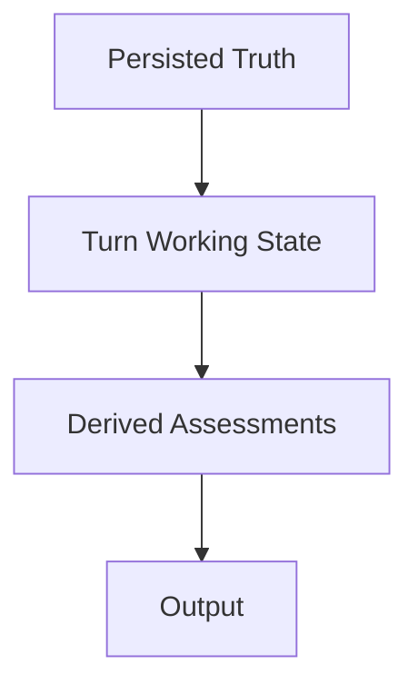
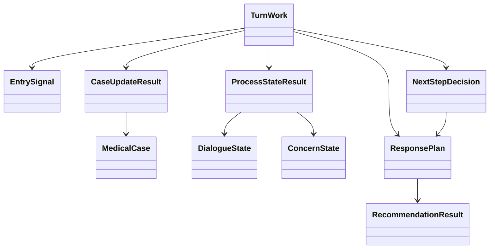
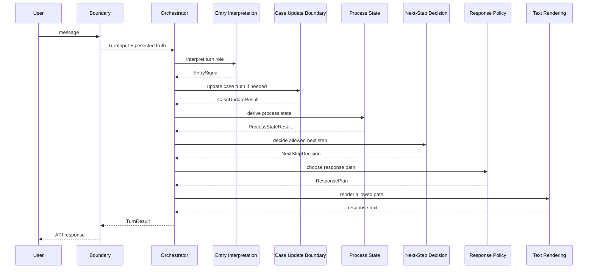

# Careena3: Zielsystem und feste Architekturgrenzen

Stand: 2026-06-13
Status: Entwurf
Bezug:

- `server/careena_pipeline3/autodoc/workbench/2026-06-13/CAREENA3_ARCHITECTURE_ABSTRACTION.md`

## Zweck

Dieses Dokument beschreibt nicht den aktuellen Code.

Es beschreibt, wie das System beschaffen sein soll, damit die eigentliche
Logik gezielt verbessert werden kann, ohne bei jeder Korrektur grosse Teile
des Systems mitzubewegen.

Die Leitfrage ist:

- Wo liegt welche Wahrheit?
- Welche Schicht darf was entscheiden?
- Welche Objekte sind dauerhaft kanonisch?
- Welche Objekte sind nur Turn-Arbeitszustand?
- Welche Teile sind nur abgeleitete Lesarten oder Ausgabe?

Wenn diese Punkte fest sind, kann Logik korrigiert werden, ohne jedes Mal
Boundary, Turn-Orchestrierung, Fallmodell, Next-Step-Logik und Textausgabe
zusammen umbauen zu muessen.

## Zielbild in einem Satz

Careena3 soll ein geschichteter medizinischer Turn-Prozessor sein, in dem
eine sichtbare Orchestrierung aus einer Nutzernachricht zuerst kanonische
Fallwahrheit fortschreibt, daraus dann Prozesslage und den erlaubten
naechsten Schritt ableitet und erst ganz am Ende einen freigegebenen
Antwortpfad formuliert.

## Architekturprinzipien

### 1. Truth first, text last

Text darf nie fehlende Fachlogik ersetzen.

Die Reihenfolge ist immer:

1. Fallwahrheit
2. Prozesslage
3. Next-Step-Entscheidung
4. Antwortpfad
5. Text

### 2. Nur wenige kanonische Wahrheitsorte

Persistente Wahrheit darf nur an wenigen klaren Orten liegen.

Alles andere ist:

- Turn-Arbeitszustand
- abgeleitete Bewertung
- Ausgabe

### 3. Orchestrierung zentral, Fachentscheidungen lokal

Die Turn-Reihenfolge soll zentral sichtbar sein.
Die fachlichen Detailentscheidungen sollen aber in kleinen, klaren
Fachvertraegen sitzen.

### 4. Kein doppelter Steuerzustand

Fuer jeden aktiven Steuerpunkt gibt es genau eine primaere Wahrheit.

Insbesondere:

- kein aktiver Spiegel fuer denselben next step
- kein paralleles Recommendation-Wissen in mehreren gleichberechtigten Feldern
- kein Antwortpfad gleichzeitig als Modus, State und Legacy-Mirror

### 5. Offene Unsicherheit wird modelliert, nicht versteckt

Wenn das System etwas noch nicht sicher weiss, braucht es dafuer sichtbare
Zustaende oder Signale.

Es darf diese Unsicherheit nicht durch:

- Fallback-Text
- Legacy-Felder
- implizite Seiteneffekte

verdecken.

## Die feste Schichtenfolge

Diese Kette ist keine Implementierungsoption, sondern die feste
Architekturrichtung des Systems.

Wichtig:

- keine spaetere Schicht schreibt rueckwirkend Fachwahrheit um
- keine fruehere Schicht entscheidet schon Text oder Recommendation-Inhalt
- keine Schicht ueberspringt ihre Nachbarn

## Die vier Wahrheitsarten

Das Zielsystem muss streng zwischen vier Arten von Information unterscheiden.

### 1. Persisted Truth

Das ist die einzige Wahrheit, die turn-uebergreifend fortlebt.

Sie besteht aus:

- `MedicalCase`
- `DialogueState`
- `ConcernState`

Diese drei Aggregate bleiben getrennt.

#### `MedicalCase`

Enthaelt nur medizinische und fallbezogene Fachwahrheit.

Darf enthalten:

- Beobachtungen
- Subjektbezug
- problembezogene medizinische Fakten
- explizite fachliche Unsicherheit, wenn noetig

Darf nicht enthalten:

- Antwortpfade
- Recommendation-Freigaben
- Text
- UI-Zustaende

#### `DialogueState`

Enthaelt nur den turn-uebergreifenden Dialogprozess.

Darf enthalten:

- offenes fachliches Follow-up
- aktiven Dialogknoten
- aufgeloeste oder offene Prozessanforderungen

Darf nicht enthalten:

- medizinische Zweitwahrheit
- finale Recommendation-Inhalte
- fertige Antwortpolitik

#### `ConcernState`

Enthaelt nur die Kontinuitaet des gerade aktiven Anliegens.

Darf enthalten:

- aktives Concern
- Concern-Phase
- Beziehung zwischen aktuellem Turn und aktivem Concern

Darf nicht enthalten:

- medizinische Fakten als Duplikat des `MedicalCase`
- Next-Step-Politik als primaere Wahrheit

### 2. Turn Working State

Das ist ein rein lokales Ausfuehrungsobjekt fuer einen Turn.

Es darf:

- Zwischenresultate sammeln
- Signale zwischen Schichten weiterreichen
- Trace-Observability tragen

Es darf nicht:

- zum zweiten kanonischen Zustand werden
- persistierte Wahrheit still ersetzen
- dauerhafte Antwortpfade spiegeln

Der heutige `TurnContext` ist dafuer zu breit.
Im Zielsystem soll er kleiner und klarer werden.

### 3. Derived Assessments

Das sind abgeleitete Lesarten aus stabilisierter Wahrheit.

Dazu gehoeren:

- Safety-Befund
- Readiness-Befund
- Next-Step-Entscheidung
- Response-Policy-Entscheidung

Diese Objekte sind wichtig, aber nicht kanonisch.
Sie duerfen jederzeit neu aus persistierter Wahrheit plus Turn-Signalen
berechnet werden.

### 4. Output

Das ist nur die Aussenflaeche fuer diesen Turn:

- `response_mode`
- `response_text`
- `recommendation_result`

Output ist nie die Quelle der Wahrheit.

## Die Kernvertraege des Zielsystems

### Vertrag A: Entry Interpretation

Diese Schicht liest die neue Nachricht nur als Einstiegssignal.

Sie beantwortet:

- ist der Turn medizinisch, dialogisch oder unklar?
- braucht es ueberhaupt Fallfortschreibung?
- ist ein Themenwechsel moeglich?
- ist dies eine Antwort auf einen bekannten Dialogknoten?

Sie beantwortet nicht:

- was medizinisch wahr ist
- ob Requirements schon erfuellt sind
- ob Recommendation freigegeben ist

Output:

- ein kleines `EntrySignal`-Objekt

Pflichtidee:

- moeglichst klein
- keine Fallmutation
- keine Response-Politik

### Vertrag B: Case Update Boundary

Dies ist die wichtigste Grenze des Systems.

Nur hier darf aus Turn-Eingabe neue persistente medizinische Wahrheit werden.

Input:

- Nachricht
- bestehender `MedicalCase`
- kleine Entry-Signale

Output:

- `CaseUpdateResult`

Der Vertrag muss mindestens sichtbar machen:

- welche medizinische Wahrheit neu oder geaendert ist
- ob ein neuer Concern plausibel ist
- welche Fallkonsequenzen fachlich offen bleiben
- welche Konflikte oder Unklarheiten explizit entstanden sind

Diese Schicht ist die einzige erlaubte Stelle fuer:

- Merge von medizinischer Wahrheit
- fachliche Konfliktaufnahme
- explizite Truth-Unsicherheit

### Vertrag C: Process State

Diese Schicht liest die aktualisierte Wahrheit und beantwortet:

- welche fachliche Anforderung ist offen?
- welche Rueckfrage ist prozessual aktiv?
- wurde eine offene Rueckfrage beantwortet?
- ist der aktuelle Concern stabil oder verschoben?

Output:

- `ProcessStateResult`

Diese Schicht entscheidet nicht:

- Recommendation-Freigabe
- Antworttext
- medizinische Fachwahrheit

### Vertrag D: Next-Step Decision

Diese Schicht entscheidet ausschliesslich:

- welcher naechste Systempfad erlaubt ist

Sie liest:

- `MedicalCase`
- `DialogueState`
- `ConcernState`
- `ProcessStateResult`
- Safety-Befund

Sie gibt genau eine primaere Steuerwahrheit zurueck:

- `NextStepDecision.allowed_next_step`

Moegliche Arten:

- `emergency`
- `ask_medical_followup`
- `ask_concern_clarification`
- `ask_dialogue_completion`
- `allow_recommendation`
- `return_to_medical`
- `out_of_scope`
- `continue_medical`

Wichtig:

- nur eine aktive Next-Step-Wahrheit
- keine Legacy-Spiegel

### Vertrag E: Response Policy

Diese Schicht uebersetzt den erlaubten naechsten Schritt und die
stabilisierte Lage in einen sichtbaren Antwortpfad.

Sie entscheidet:

- welche Antwortart der Nutzer jetzt sieht
- welche dialogische Funktion diese Antwort hat
- ob Recommendation-Inhalt gebaut werden darf

Sie entscheidet nicht:

- medizinische Wahrheit
- Prozesswahrheit
- freie Umdeutung des next step

Output:

- `ResponsePlan`

### Vertrag F: Text Rendering

Diese Schicht formuliert nur einen bereits freigegebenen Pfad.

Sie darf:

- phrasing
- bounded LLM wording
- statische Texte

Sie darf nicht:

- den erlaubten naechsten Schritt umschreiben
- neue medizinische Logik einfuehren
- Recommendation-Freigabe selbst erzeugen

## Das Ziel-Objektmodell

Die wichtigste Leseregel hier ist:

- `MedicalCase`, `DialogueState`, `ConcernState` sind langlebige Wahrheit
- alles andere ist Turn-intern oder abgeleitet

## Zielbild fuer den Turn-Ablauf

## Was das Zielsystem ausdruecklich vermeiden muss

### 1. Ein riesiges Alles-Objekt

Es darf kein Turn-Objekt geben, das gleichzeitig ist:

- persistenter Wahrheitscontainer
- Next-Step-Container
- Response-Container
- Textcontainer

Ein Arbeitsobjekt darf orchestration-facing sein, aber nicht der zweite
Systemkern werden.

### 2. Doppelte Next-Step-Wahrheit

Es darf nie parallel geben:

- einen aktiven `allowed_next_step`
- und einen zweiten aktiven Spiegel desselben Werts

### 3. Recommendation als verteiltes Gefuehl

Recommendation darf nicht aus einem diffusen Zusammenspiel von:

- `recommendation_requested`
- `recommendation_ready`
- `pending_transition`
- `response_mode`

erraten werden.

Es braucht genau eine lesbare Next-Step-Lage und genau eine lesbare
Response-Freigabe.

### 4. Text als Reparaturort

Keine Schicht darf darauf bauen, dass ein guter Antworttext schon kaschiert,
dass der Zustand darunter unklar ist.

### 5. Prozess und Concern nicht vermischen

Folgende Fragen muessen getrennt bleiben:

- Ist medizinisch genug Wahrheit da?
- Welcher Concern ist aktiv?
- Welche Rueckfrage ist offen?
- Welcher naechste Schritt ist freigegeben?

Wenn diese Fragen in einem Objekt verschwimmen, beginnt das System wieder
grossflaechig zu driften.

## Die zentrale Logik, die stabil bleiben soll

Wenn kuenftig etwas "fachlich gefixt" wird, soll es fast immer in genau einer
dieser Zonen passieren:

- Entry Interpretation
- Case Update Boundary
- Process State
- Next-Step Decision
- Response Policy

Boundary, Text Rendering und Runtime-Verdrahtung sollen dabei weitgehend
unveraendert bleiben.

Das ist der eigentliche Gewinn des Zielsystems:

- fachliche Aenderungen werden lokal
- systemweite Verschiebungen werden selten

## Wo welche Arten von Problemen kuenftig hingehoeren

### Wenn das System medizinische Information falsch zusammenfuehrt

Dann ist das ein Problem der:

- Case Update Boundary

Nicht der Response-Schicht.

### Wenn das System dieselbe Rueckfrage wiederholt oder falsch offen haelt

Dann ist das ein Problem der:

- Process State Schicht

Nicht der Textschicht.

### Wenn das System zu frueh oder zu spaet eine Recommendation anbietet

Dann ist das ein Problem der:

- Next-Step Decision
- oder Response Policy

Nicht des `MedicalCase`.

### Wenn die Formulierung schlecht ist, aber der Pfad richtig

Dann ist das ein Problem von:

- Text Rendering

Nicht der Architekturmitte.

## Zielbild fuer Dateien und Schichtzuordnung

Die konkrete Dateistruktur darf sich spaeter aendern.
Die Schichtzuordnung darf sich aber nicht verwischen.

Empfohlene dauerhafte Rollen:

- `careena3.py`
  nur Boundary
- `DialogueManager`
  nur Turn-Orchestrierung
- Entry-Komponente
  nur Turn-Einstiegssignale
- Case-Update-Komponente
  nur Truth-Kante
- Process-State-Komponente
  nur Prozess- und Requirement-Fortschreibung
- Next-Step-Komponente
  nur Next-Step-Entscheidung
- Response-Policy-Komponente
  nur sichtbarer Antwortpfad
- Text-Komponente
  nur Formulierung

## Minimale Refactor-Regel fuer alle kuenftigen Aenderungen

Jede kuenftige Aenderung soll gegen diese vier Fragen geprueft werden:

1. Welche Wahrheit wird hier veraendert?
2. Ist diese Schicht dafuer ueberhaupt zustaendig?
3. Entsteht hier eine zweite Wahrheit fuer etwas, das schon anderswo kanonisch ist?
4. Ist das Problem fachlich lokal oder wird gerade Architektur drift repariert?

Wenn auf Frage 2 oder 3 die Antwort unsauber ist, sollte die Aenderung nicht
direkt implementiert, sondern zuerst architektonisch neu geschnitten werden.

## Schlussbild

Das Zielsystem ist nicht "mehr Services", "mehr Manager" oder "mehr Calls".

Das Zielsystem ist:

- wenige kanonische Wahrheiten
- ein klarer Turn-Ablauf
- genau eine Truth-Kante
- genau eine aktive Next-Step-Wahrheit
- spaete, disziplinierte Response-Policy
- Text nur als Formulierung freigegebener Bahnen

Wenn diese Architektur stabil wird, kann die eigentliche medizinische und
dialogische Logik endlich lokal verbessert werden, ohne dass jedes Problem
wieder das halbe System in Bewegung setzt.
